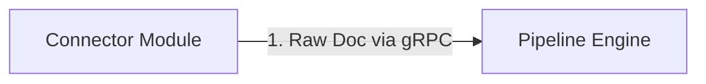
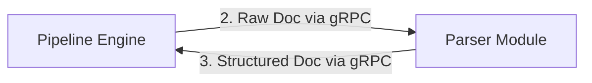
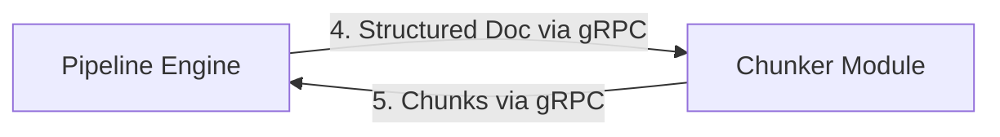
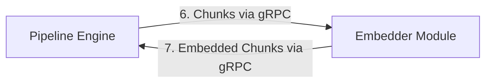
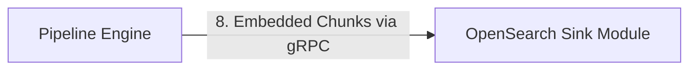
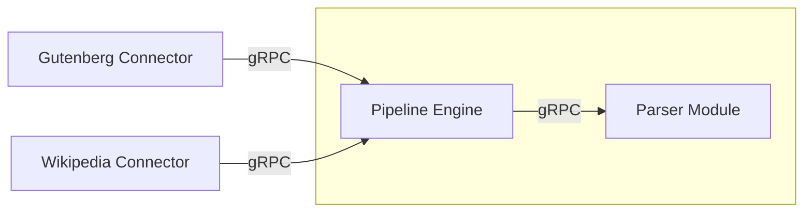
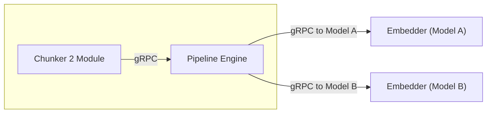
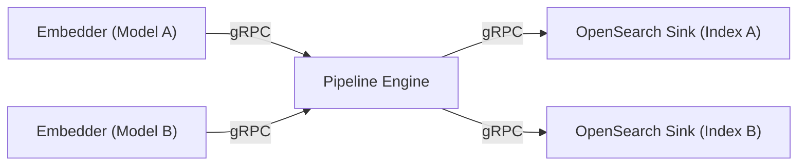
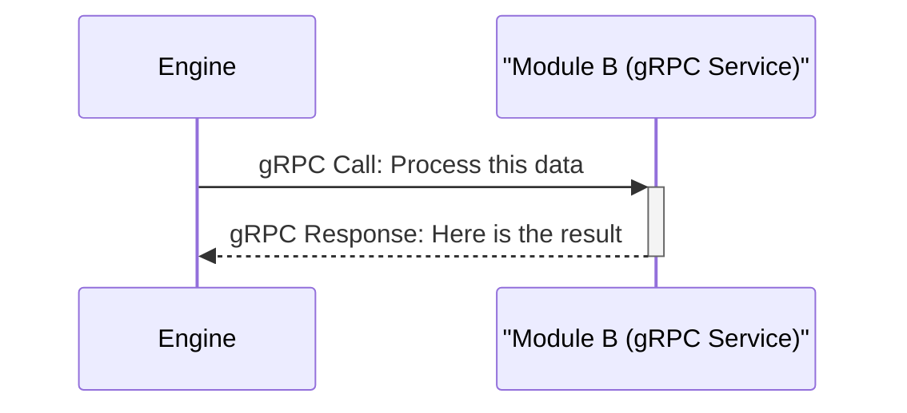
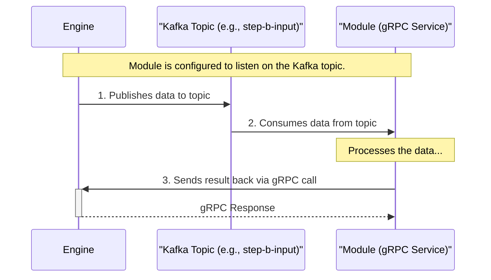

# Pipeline Engine: Architecture Overview

## Introduction

The Pipeline Engine is a powerful and flexible data processing system designed for building complex, scalable, and language-agnostic data workflows. It excels at document extraction and manipulation, making it an ideal foundation for creating sophisticated search engine pipelines. Out of the box, the system allows you to define multiple data processing pipelines that can ingest data from various sources (like websites, file systems, or databases), process it through a series of transformation steps (like parsing, chunking, and embedding), and load it into search backends like OpenSearch.

### The Core Principle: The Engine is the Orchestrator

To understand how the system works, there is one critical rule: **Modules never talk to each other directly. They only talk to the Engine.**

The Engine is the central hub that manages the entire data flow. It receives data from one module, looks at the pipeline's configuration to decide what to do next, and then sends the data to the next module in the sequence. The modules themselves are simple, focused gRPC services that just do their one job and report the results back to the Engine.

Let's explore this with two examples.

## Core Concepts and Technologies

The Pipeline Engine is built on a set of modern, robust technologies designed for creating distributed systems. Its architecture provides significant flexibility, allowing developers to build and modify complex data pipelines dynamically.

### Architectural Flexibility

A key design principle of the engine is its dynamic nature. Pipeline definitions—the sequence of steps and their configurations—are stored externally in Consul. The Engine reads this configuration at runtime. This means you can:

*   **Modify Pipelines without Redeployment:** Change the order of steps, add new steps, or alter a module's configuration on-the-fly. The Engine will detect the changes and adjust its behavior without needing to be restarted or redeployed.
*   **Language-Agnostic Modules:** Modules are the workhorses of the pipeline, and they can be written in any programming language that supports gRPC (such as Python, Go, Node.js, or Rust). This allows teams to use the best tool for the job or leverage existing codebases.
*   **Proxy for Enhanced Capabilities:** For modules not written in Java, the optional `proxy-module` can be used. This proxy sits in front of a non-Java module and automatically provides it with features from the Java ecosystem, such as advanced telemetry, metrics, security, and standardized testing endpoints, without the module developer needing to implement them.

### Components at a Glance

| Component | Role | Technology | Description |
| :--- | :--- | :--- | :--- |
| **Pipeline Engine** | **Orchestrator** | Java (Quarkus) | The central brain of the system. It reads pipeline configurations, discovers modules, and routes data between them using either gRPC for synchronous calls or Kafka for asynchronous messaging. |
| **Modules** | **Workers** | Any (gRPC) | Standalone gRPC services that perform a single, specific task, such as parsing a document, chunking text, or generating embeddings. They are language-agnostic. |
| **Consul** | **Service Registry & Config Store** | HashiCorp Consul | Used for service discovery (so the Pipeline Engine can find modules) and as a Key-Value store for all pipeline configurations. |
| **MongoDB** | **Document Storage** | MongoDB | The initial implementation for storing document state and metadata. This will evolve into a generic document storage interface. |
| **Kafka** | **Message Bus (Optional)** | Apache Kafka | An optional but recommended transport for asynchronous communication between steps. It provides buffering, durability, and decoupling for high-throughput workflows. |
| **Prometheus** | **Metrics (Optional)** | Prometheus | An optional but recommended component for collecting metrics from the Engine and modules for monitoring. |
| **Grafana** | **Visualization (Optional)** | Grafana | An optional but recommended tool for creating dashboards to visualize metrics collected by Prometheus. |

### Technology Stack

*   **gRPC:** The primary communication protocol between the Engine and all modules.
*   **Protocol Buffers:** Defines the data contracts and service interfaces.
*   **Java (Quarkus):** The core Engine is built using the Quarkus framework for high performance and a rich feature set.
*   **Docker:** All components, including the Engine and modules, are designed to be run as containers.
*   **Consul:** For service discovery and distributed configuration.
*   **MongoDB:** For document and state storage.
*   **Apache Kafka (Optional):** For asynchronous messaging.
*   **Prometheus (Optional):** For metrics collection.
*   **Grafana (Optional):** For metrics visualization.

---

## Example 1: A Simple, Serial Document Processing Pipeline

In this scenario, we will trace a single document through a linear pipeline: a connector fetches the document, it gets parsed, chunked, embedded, and finally saved to a single destination.

### Step 1: Connector to Engine

The process starts when a Connector module fetches a document and sends it to the Engine.

*   The `Gutenberg Connector` fetches an e-book.
*   It makes a single gRPC call to the **Engine**, sending the raw document data.

### Step 2: Engine to Parser and Back

The Engine, knowing the first processing step is the `Parser`, orchestrates the next action.

*   The Engine calls the `Parser` module with the raw document.
*   The `Parser` cleans the HTML, extracts the plain text, and returns the structured result **back to the Engine**.

### Step 3: Engine to Chunker and Back

The pattern repeats. The Engine now sends the parsed text to the `Chunker`.

*   The Engine calls the `Chunker` module with the structured document.
*   The `Chunker` splits the text into smaller pieces and returns these chunks **back to the Engine**.

### Step 4: Engine to Embedder and Back

The chunks are now ready for vector embedding.

*   The Engine calls the `Embedder` module with the document chunks.
*   The `Embedder` uses a machine learning model to generate vector embeddings and returns the enriched chunks **back to the Engine**.

### Step 5: Engine to Sink

Finally, the Engine sends the fully processed data to its destination.

*   The Engine calls the `OpenSearch Sink` module with the embedded chunks.
*   The Sink module indexes the data into an OpenSearch cluster. Since this is a final step, the Sink doesn't need to return any data to the Engine.

This simple, step-by-step flow, orchestrated entirely by the Engine, forms the basis of all pipeline operations.

---

## Example 2: A Complex Pipeline with Fan-in and Fan-out

Now, let's look at a more advanced scenario that demonstrates the full power of the Engine's orchestration, including A/B testing of different embedding models.

### Step 1: Connectors to Engine (Fan-in)

The pipeline starts by ingesting documents from multiple sources simultaneously.

*   Both the `Gutenberg Connector` and `Wikipedia Connector` run in parallel, sending their documents to the **Engine**.
*   The Engine receives documents from both sources and, as per the configuration, sends each one to the `Parser` module. This is "fan-in".

### Step 2: Sequential Processing (Parser -> Chunker -> Chunker2)

The initial processing steps are sequential, just like in our simple example. The data flows from `Parser` -> `Engine` -> `Chunker` -> `Engine` -> `Chunker2` -> `Engine`.

### Step 3: Engine to Embedders (Fan-out for A/B Testing)

This is where the pipeline branches. The Engine receives the refined chunks from `Chunker2` and sends them to two different Embedder modules in parallel.

*   The Engine makes two separate gRPC calls with the *same chunked data*.
*   `Embedder1` uses a general-purpose embedding model.
*   `Embedder2` uses a different, experimental model. This is "fan-out".

### Step 4: Embedders to Engine to Sinks (Fan-out to Destinations)

Each embedder returns its results to the Engine, which then sends them to separate destinations for A/B testing.

*   `Embedder1` returns chunks with "Embedding A" to the Engine. The Engine forwards this data to `OpenSearch Sink 1`, which writes to `Index A`.
*   `Embedder2` returns chunks with "Embedding B" to the Engine. The Engine forwards this data to `OpenSearch Sink 2`, which writes to `Index B`.
*   Now you can run search queries against both OpenSearch indices to compare the performance of the two embedding models.

---

## How Kafka Fits In: An Engine-Managed Transport Option

So where does Kafka come in? Kafka is an **optional transport mechanism that the Engine can use internally** to communicate with modules. The modules themselves remain simple gRPC services.

The choice between a direct gRPC call and sending a message via Kafka is defined in the pipeline configuration for each step transition.

### Standard Flow (gRPC)

### Asynchronous Flow (Kafka)

By managing the transport layer, the Engine provides flexibility and resilience. Developers creating modules don't need to worry about Kafka integration; they only need to implement the standard gRPC `PipeStepProcessor` service. This keeps modules simple and focused, while the Engine handles the complex orchestration and routing logic.