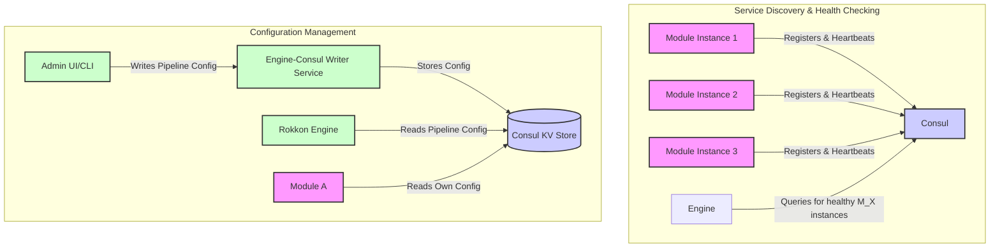

# Rokkon Engine: Architecture Overview

## High-Level Overview

The Rokkon Engine is a powerful and flexible data processing pipeline designed for building complex, scalable, and language-agnostic data workflows. It empowers developers to create pipeline steps, connectors (sources of data), and sinks (destinations for data) using any programming language that supports gRPC.

At its core, Rokkon is built around the concept of distributed, interconnected modules that communicate via gRPC and can leverage Kafka for asynchronous data transfer between steps. This architecture allows for:

*   **Language Agnosticism:** Modules can be written in Python, Java, Go, Node.js, C++, Rust, or any other gRPC-supported language. This enables teams to use the best language for a specific task or leverage existing libraries and expertise.
*   **Scalability:** Each pipeline step (module) can be independently scaled. The engine supports fan-in/fan-out patterns, allowing multiple instances of a module to process data in parallel or for data to be distributed across different subsequent steps.
*   **Flexibility:** Pipelines are dynamically configurable and can be modified without recompiling the core engine.
*   **Resilience:** The system is designed for fault tolerance, with features like health checks, service discovery, and configurable retry mechanisms.

### Fan-in/Fan-out Capabilities

Each step in a Rokkon pipeline can exhibit fan-in or fan-out behavior:

*   **Fan-out:** A single pipeline step can send its output to multiple subsequent steps. This is useful for tasks like:
    *   Processing the same data in different ways simultaneously (e.g., generating different types of embeddings).
    *   Distributing data to different sinks for A/B testing or varied storage needs.
    *   Triggering multiple independent downstream workflows.
*   **Fan-in:** Multiple pipeline steps can send their output to a single subsequent step. This is useful for:
    *   Aggregating results from parallel processing tasks.
    *   Combining data from multiple sources before further processing.

Communication between steps can occur synchronously via gRPC or asynchronously via Kafka:

*   **gRPC:** For low-latency, direct communication between steps, especially suitable for request/response patterns or when immediate processing is required.
*   **Kafka:** For decoupling steps, enabling durable messaging, and supporting high-throughput scenarios. Kafka acts as a buffer and allows steps to consume data at their own pace.

```mermaid
graph TD
    subgraph "Rokkon Engine Core"
        direction LR
        Engine[Rokkon Engine API/Orchestrator]
        Consul[Consul Service Discovery & KV Store]
        Kafka[Apache Kafka Messaging]

        Engine -- Manages/Reads Config --> Consul
        Engine -- Discovers Modules --> Consul
        Engine -- Orchestrates --> StepA
        Engine -- Orchestrates --> StepB
        Engine -- Orchestrates --> StepC
    end

    subgraph "Pipeline Modules (gRPC Services)"
        direction LR
        Connector1[Connector Module 1<br>(e.g., Python)]
        Connector2[Connector Module 2<br>(e.g., Go)]
        StepA[Processing Step A<br>(e.g., Java)]
        StepB[Processing Step B<br>(e.g., Python)]
        StepC[Processing Step C<br>(e.g., Node.js)]
        Sink1[Sink Module 1<br>(e.g., Java)]
        Sink2[Sink Module 2<br>(e.g., Go)]
    end

    User[User/API Client] -- Defines/Controls Pipeline --> Engine

    %% Data Flow Example
    Connector1 -- gRPC/Kafka --> StepA
    Connector2 -- gRPC/Kafka --> StepA
    StepA -- gRPC/Kafka --> StepB
    StepB -- gRPC/Kafka --> StepC
    StepC -- gRPC/Kafka --> Sink1
    StepC -- gRPC/Kafka --> Sink2


    classDef module fill:#f9f,stroke:#333,stroke-width:2px;
    classDef coreComponent fill:#lightgrey,stroke:#333,stroke-width:2px;

    class Connector1,Connector2,StepA,StepB,StepC,Sink1,Sink2 module;
    class Engine,Consul,Kafka coreComponent;
```

### Role of Consul

Consul plays a critical role in the Rokkon Engine ecosystem:

1.  **Service Discovery:** Each pipeline module (connector, step, sink) registers itself with Consul upon startup. The Rokkon Engine and other modules use Consul to discover the network location (IP address and port) of available services. This allows for dynamic scaling and resilience, as new instances are automatically discovered and failing instances are removed.
2.  **Health Checking:** Consul performs health checks on registered modules. The engine uses this health information to route data only to healthy instances, improving the overall reliability of the pipelines.
3.  **Distributed Key-Value (KV) Store:** Rokkon Engine stores pipeline definitions, module configurations, and other dynamic operational data in the Consul KV store. This provides a centralized and consistent way to manage configurations, which can be updated dynamically without restarting the engine or modules. The engine watches for changes in Consul and adapts pipeline behavior accordingly.



## Example Scenario: Building a Document Processing and Analysis Pipeline

Let's consider a realistic scenario where we want to ingest documents from the Gutenberg Library and Wikipedia, process them, generate embeddings, and store them in multiple OpenSearch instances for A/B testing search relevance.

**Pipeline Definition:**

1.  **Initial Steps (Connectors - Fan-in to Parser):**
    *   `Gutenberg Library Connector`: A module (e.g., written in Python using `requests` and `BeautifulSoup`) that fetches e-books from Project Gutenberg.
    *   `Wikipedia Connector`: A module (e.g., written in Go using Wikipedia's API client) that fetches articles from Wikipedia.
    *   Both connectors output raw document content (text, HTML, etc.).

2.  **`Parser` Step:**
    *   Receives raw content from both connectors.
    *   Cleans HTML, extracts plain text, and normalizes the content.
    *   Outputs structured document data (e.g., title, body, source URL).

3.  **`Chunker` Step:**
    *   Receives structured documents from the `Parser`.
    *   Splits large documents into smaller, manageable chunks (e.g., paragraphs or fixed-size token blocks). This is crucial for effective embedding generation.
    *   Outputs individual document chunks.

4.  **`Chunker 2` Step (Illustrating Fan-out/Fan-in for specialized processing):**
    *   This could be a specialized chunker that operates on the output of the first `Chunker`. For example, it might further subdivide chunks based on semantic boundaries or prepare chunks specifically for a different embedding model.
    *   Alternatively, `Chunker` and `Chunker 2` could run in parallel, processing different aspects or using different strategies on the output of `Parser`. For this example, let's assume `Chunker 2` refines the output of `Chunker 1`.

5.  **`Embedder` Step:**
    *   Receives document chunks from `Chunker 2`.
    *   Uses a sentence transformer model (e.g., Sentence-BERT, loaded in a Python module) to generate vector embeddings for each chunk.
    *   Outputs chunks enriched with their vector embeddings.

6.  **`Embedder 2` Step (Illustrating Fan-out for multiple embedding types):**
    *   This step runs in parallel with the `Embedder` step, receiving the same chunks from `Chunker 2`.
    *   It uses a *different* embedding model (e.g., a multilingual model or a domain-specific model) to generate a second set of vector embeddings for each chunk.
    *   **Why this results in 4 vectors (conceptually):** If each embedder produces a primary vector and perhaps a title vector (or some other contextual vector), then having two embedders means each chunk is now associated with:
        1.  Vector from Embedder 1 (e.g., general purpose)
        2.  Contextual vector from Embedder 1 (if applicable)
        3.  Vector from Embedder 2 (e.g., multilingual)
        4.  Contextual vector from Embedder 2 (if applicable)
    *   More simply, if each embedder generates one vector per chunk, the chunk now has two distinct vector representations. If "4 vectors" implies a dimensionality (e.g., two 2D vectors), that's also possible. For this example, we'll assume each embedder generates one vector, so a chunk has two vector representations. The "4 vectors" could refer to a scenario where a pipeline might split the data further, or if each embedder itself produced multiple distinct embedding types for a single input. For clarity, let's say each chunk now has *two different* vector embeddings.

7.  **Final Steps (Sinks - Fan-out from Embedders):**
    *   The outputs from `Embedder` (containing embedding set 1) and `Embedder 2` (containing embedding set 2) are fanned out.
    *   `OpenSearch Sink`: A module (e.g., written in Java using the OpenSearch client) that takes the enriched chunks (with embedding set 1) and indexes them into an OpenSearch cluster.
    *   `OpenSearch Sink 2`: Another instance of the OpenSearch Sink module (or a differently configured one) that takes the enriched chunks (with embedding set 2) and indexes them into a *separate* OpenSearch cluster or a different index within the same cluster.
    *   **Usefulness for A/B Testing:** Having data indexed with different embedding models in separate OpenSearch instances (or indices) allows for A/B testing of search relevance. Queries can be run against both versions, and user engagement or relevance metrics can be compared to determine which embedding strategy yields better search results.

**Mermaid Diagram of the Example Scenario:**

```mermaid
graph LR
    subgraph "Data Sources (Connectors)"
        Gutenberg[Gutenberg Library Connector]
        Wikipedia[Wikipedia Connector]
    end

    subgraph "Processing Steps"
        Parser[Parser]
        Chunker1[Chunker]
        Chunker2[Chunker 2 (Refiner/Specializer)]
        Embedder1[Embedder (Model A)]
        Embedder2[Embedder 2 (Model B)]
    end

    subgraph "Data Destinations (Sinks)"
        OpenSearch1[OpenSearch Sink (Index A)]
        OpenSearch2[OpenSearch Sink 2 (Index B for A/B Test)]
    end

    %% Data Flow
    Gutenberg -- Raw Docs --> Parser
    Wikipedia -- Raw Docs --> Parser
    Parser -- Structured Docs --> Chunker1
    Chunker1 -- Chunks --> Chunker2
    Chunker2 -- Refined Chunks --> Embedder1
    Chunker2 -- Refined Chunks --> Embedder2 %% Fan-out to parallel embedders

    Embedder1 -- Chunks + Embedding A --> OpenSearch1
    Embedder2 -- Chunks + Embedding B --> OpenSearch2

    %% Illustrating potential direct path for A/B testing if Embedder2 output is also sent to OS1
    %% Embedder2 -- Chunks + Embedding B --> OpenSearch1 %% Option for combined index

    classDef connector fill:#lightblue,stroke:#333,stroke-width:2px;
    classDef processor fill:#lightgreen,stroke:#333,stroke-width:2px;
    classDef sink fill:#lightcoral,stroke:#333,stroke-width:2px;

    class Gutenberg,Wikipedia connector;
    class Parser,Chunker1,Chunker2,Embedder1,Embedder2 processor;
    class OpenSearch1,OpenSearch2 sink;
```

This example demonstrates how Rokkon's architecture supports complex data processing workflows, including fan-in from multiple sources, sequential processing, parallel processing with fan-out (to `Embedder` and `Embedder 2`), and fan-out to multiple sinks for purposes like A/B testing. Each component can be developed, deployed, and scaled independently.

## Further Reading

To understand how such pipelines are constructed and managed within the Rokkon Engine, refer to the following documentation:

*   **Pipeline Design (`Pipeline_design.md`):** This document details the logical design of pipeline clusters, pipelines, pipeline steps, and modules. It also covers the dynamic configuration system.
*   **Module Deployment (`Module_deployment.md`):** Explains the process of deploying and registering modules with the Rokkon Engine.
*   **Rokkon Protobufs (`rokkon-protobuf/README.md`):** Describes the gRPC service definitions and message types that form the communication backbone of the engine and its modules.
*   **Developer Notes (`DEVELOPER_NOTES/`):** Contains various notes relevant to the design and implementation details, including specific architectural decisions and plans. (Refer to `DEVELOPER_NOTES/rokkon-engine/ARCHITECTURE_AND_PLAN.md` for more engine-specific details).

By leveraging gRPC for inter-module communication and Consul for service discovery and configuration, the Rokkon Engine provides a robust platform for building sophisticated, distributed data processing applications.
