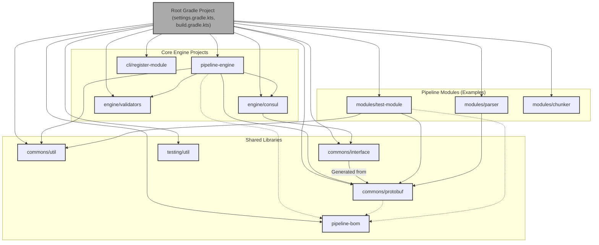

# Pipeline Engine: Build System

The Pipeline Engine project and its associated modules primarily use Gradle as their build automation system. Gradle provides a flexible and powerful way to manage dependencies, compile code, run tests, package applications, and build Docker images. The build system is structured as a multi-project Gradle build, allowing for modularity and clear separation of concerns.

## Gradle Multi-Project Structure

The Pipeline ecosystem is composed of several sub-projects, each with its own `build.gradle.kts` file. A top-level `settings.gradle.kts` file defines these sub-projects and their relationships.

Key sub-projects typically include:

*   **`pipeline-engine`:** The core engine application (Quarkus based).
*   **`engine/consul`:** Handles all write operations to Consul.
*   **`commons/interface`:** Contains shared data models (POJOs, potentially generated from Protobufs).
*   **`engine/validators`:** Provides validation logic for configurations and data.
*   **`cli/register-module`:** The command-line tool for module registration.
*   **`commons/protobuf`:** Contains all Protocol Buffer definitions and generates gRPC stubs.
*   **`commons/util`:** Shared utility classes and libraries.
*   **`modules/` directory:**
    *   `modules/test-module`
    *   `modules/parser`
    *   `modules/chunker`
    *   `modules/embedder`
    *   `modules/echo`
    *   `modules/proxy-module`
    *   (Each module is its own Gradle sub-project, often a Quarkus application if Java-based, or a simple project if in another language but still managed under the Gradle umbrella for build/Docker tasks).
*   **`pipeline-bom` (Bill of Materials):** Manages dependency versions across projects.
*   **`testing/util`:** Common code and resources for testing.



## Standard Gradle Tasks and Build Lifecycle

Each Gradle sub-project (especially Quarkus-based ones) utilizes standard Gradle tasks and lifecycles:

1.  **Compilation:**
    *   `./gradlew :<project-name>:compileJava` (for Java projects)
    *   `./gradlew :<project-name>:compileKotlin` (if Kotlin is used)
    *   The `commons/protobuf` project uses the Protobuf Gradle plugin to generate Java (or other languages) sources from `.proto` files during the `generateProto` task, which is typically hooked into the compilation lifecycle.

2.  **Testing:**
    *   `./gradlew :<project-name>:test`: Runs unit tests.
    *   `./gradlew :<project-name>:integrationTest` (or a custom task like `quarkusIntTest`): Runs integration tests. Quarkus projects often have dedicated integration test source sets (`src/integrationTest/java`).
    *   `./gradlew test`: Runs tests for all sub-projects.
    *   `./gradlew check`: Runs tests and other verification tasks (e.g., linting).

3.  **Packaging:**
    *   `./gradlew :<project-name>:jar`: Creates a standard JAR file.
    *   `./gradlew :<project-name>:quarkusBuild` (for Quarkus projects): Creates an executable uber-JAR (in `build/quarkus-app/quarkus-run.jar`) and other artifacts needed for running the Quarkus application. This is the primary packaging task for deployable services like `pipeline-engine` or Java-based modules.

4.  **Building Docker Images (Quarkus Integration):**
    *   Quarkus has excellent integration with Docker image building.
    *   `./gradlew :<project-name>:quarkusBuild -Dquarkus.container-image.build=true`: Builds the application and then builds a Docker image using the configuration specified in `application.yml` (or `.properties`) and the Dockerfile found in `src/main/docker/`.
        *   Relevant `application.yml` properties:
            ```yaml
            quarkus:
              container-image:
                build: true
                group: pipeline # Docker Hub username or organization
                name: <module-name> # e.g., pipeline-engine, python-parser
                tag: latest # Or a dynamic version
                registry: nas.pipeline.com:5000 # Optional private registry
                push: false # Whether to auto-push after build
                dockerfile: src/main/docker/Dockerfile.jvm # Path to Dockerfile
            ```
    *   Many modules have a `docker-build.sh` script (e.g., `modules/chunker/docker-build.sh`) which often wraps the Gradle command for building the Docker image. This script might also handle pre-build steps like building dependent projects (e.g., ensuring `pipeline-cli.jar` is built before a module image that needs it).

5.  **Dependency Management:**
    *   Dependencies are declared in the `dependencies { ... }` block of each `build.gradle.kts` file.
    *   The `pipeline-bom` (Bill of Materials) project is used to centralize and manage versions of common dependencies across all sub-projects. This ensures consistency and simplifies version updates.
        ```kotlin
        // In pipeline-bom/build.gradle.kts
        javaPlatform {
            allowDependencies()
        }
        dependencies {
            api(platform("io.quarkus:quarkus-bom:${quarkusVersion}"))
            // Define versions for common libraries
            constraints {
                api("com.google.guava:guava:31.0.1-jre")
                api("org.apache.kafka:kafka-clients:3.0.0")
                // ... other common dependencies
            }
        }

        // In other sub-projects (e.g., pipeline-engine/build.gradle.kts)
        dependencies {
            implementation(platform(project(":pipeline-bom"))) // Import the BOM
            implementation("io.quarkus:quarkus-resteasy-reactive-jackson") // Version managed by Quarkus BOM
            implementation("com.google.guava:guava") // Version managed by pipeline-bom
            implementation(project(":commons:interface")) // Dependency on another sub-project
        }
        ```

## CLIs and How They Work with Docker

The Pipeline ecosystem includes several Command Line Interfaces (CLIs), and their interaction with Docker is important for module deployment and operations.

1.  **`cli/register-module` (`pipeline-cli.jar`):**
    *   **Purpose:** Used by modules (typically within their `module-entrypoint.sh` script) to register themselves with the Pipeline Engine.
    *   **Build:** This is a Quarkus application packaged as an executable JAR via `./gradlew :cli:register-module:quarkusBuild`.
    *   **Docker Integration:**
        *   The `pipeline-cli.jar` is often copied into module Docker images during their build process.
            ```gradle
            // In a module's build.gradle.kts (example task)
            tasks.register<Copy>("copyPipelineCliForDocker") {
                dependsOn(":cli:register-module:quarkusBuild") // Ensure CLI is built first
                from(project(":cli:register-module").tasks.named("quarkusBuild").map { it.outputs.files.singleFile })
                into(layout.buildDirectory.dir("docker-context")) // Or directly into where Dockerfile expects it
                rename { "pipeline-cli.jar" }
            }
            // This task would be a dependency for the Docker image build
            ```
        *   The module's `Dockerfile` then copies this JAR:
            ```dockerfile
            # In a module's Dockerfile
            COPY build/docker-context/pipeline-cli.jar /deployments/pipeline-cli.jar
            ```
        *   The `module-entrypoint.sh` script inside the container then executes this JAR:
            ```bash
            # In module-entrypoint.sh
            java -jar /deployments/pipeline-cli.jar register --module-host ... --engine-host ...
            ```

2.  **`engine/seed-config` Utility:**
    *   **Purpose:** Seeds initial configurations into Consul.
    *   **Build:** Likely another Quarkus application packaged as an executable JAR.
    *   **Docker Integration:**
        *   It can be run locally as a Java application.
        *   It could also be packaged into its own Docker image to be run as a standalone tool or as a Kubernetes Job/InitContainer.
            ```bash
            # Running seed-config via Docker (if it has its own image)
            docker run --rm \
              -e CONSUL_HOST=my-consul-server \
              -v ./seed-data.json:/app/seed-data.json \
              pipeline/seed-config-tool:latest --config /app/seed-data.json
            ```

3.  **Operational CLI (Hypothetical - for managing engine/pipelines):**
    *   **Purpose:** As discussed in `Operations.md`, a CLI for managing pipelines, viewing status, etc.
    *   **Build:** Could be a Quarkus Picocli application or similar, packaged as an executable JAR or native executable.
    *   **Docker Integration:**
        *   This CLI would typically be run *outside* the main engine/module containers, on an operator's machine or a CI/CD runner.
        *   It would communicate with the Pipeline Engine's REST API.
        *   No direct Docker image integration is usually needed unless it's provided as a "CLI tool" Docker image for convenience.

## Build Scripts (`scripts/`)

The `scripts/` directory in the repository root contains various shell scripts to automate common build and deployment tasks:

*   **`build-images.sh`:** Likely iterates through specified modules (or all modules) and triggers their Docker image builds (e.g., by calling their respective `docker-build.sh` scripts or the Gradle `quarkusBuild` task with container image build enabled).
*   **`deploy-to-registry.sh`:** Pushes locally built Docker images to a configured container registry.
*   **`deploy.sh`:** Might orchestrate deployment to a specific environment (e.g., Docker Compose, Kubernetes `kubectl apply`).
*   **`test-all.sh`:** A convenience script to run all tests across all relevant sub-projects (`./gradlew test` or `./gradlew check`).
*   **`setup-module-registration.sh`:** As per `DEVELOPER_NOTES/modules/README-registration.md`, this script helps set up a new module project with the necessary build configurations and Dockerfile modifications for automated registration using `pipeline-cli.jar`.

These scripts often provide a higher-level interface to the underlying Gradle tasks and Docker commands, simplifying the developer and CI/CD experience.

## Continuous Integration / Continuous Deployment (CI/CD)

While not explicitly detailed, a typical CI/CD pipeline for Pipeline would leverage this build system:

1.  **Trigger:** Code push to a version control repository (e.g., Git).
2.  **Build Stage:**
    *   Checkout code.
    *   `./gradlew clean build` (or `check`) - compiles, tests, packages all projects.
    *   Publish artifacts (JARs, BOM) to an artifact repository (e.g., Nexus, Artifactory).
3.  **Docker Image Build Stage:**
    *   Run `./scripts/build-images.sh` (or individual Gradle `quarkusBuild -Dquarkus.container-image.build=true` commands for each service/module).
4.  **Push to Registry Stage:**
    *   Run `./scripts/deploy-to-registry.sh` to push images to the container registry.
5.  **Deployment Stage:**
    *   Run `./scripts/deploy.sh` or use tools like Helm, ArgoCD, Jenkins, GitLab CI to deploy the new image versions to target environments (dev, staging, prod). This would involve updating Kubernetes Deployments, restarting Docker Compose services, etc.
    *   Run `seed-config` utility if configuration schema changes or new default configurations are needed.

The Gradle build system, with its multi-project structure, Quarkus integration, and supporting shell scripts, provides a comprehensive foundation for building, testing, and packaging the entire Pipeline Engine ecosystem.
