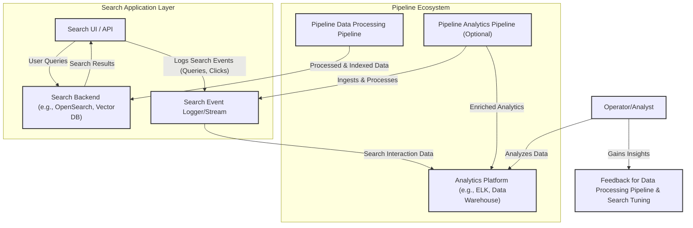
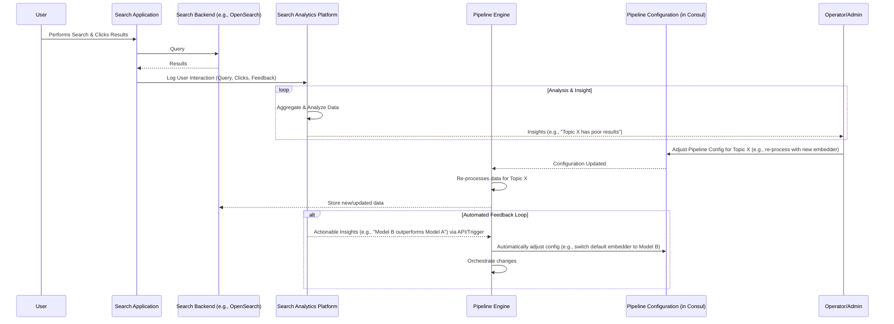

# Pipeline Engine: Future - Search Capabilities

While the Pipeline Engine's primary role is data processing and pipeline orchestration, the ultimate goal of many data pipelines is to prepare data for effective search and analysis. This document outlines future plans to integrate and expose search capabilities, leveraging the processed data indexed by Pipeline's sink modules.

The vision is not for Pipeline Engine itself to become a search engine, but to:
1.  Ensure data is optimally prepared and indexed in various search backends (e.g., OpenSearch, vector databases).
2.  Potentially provide a thin abstraction layer or tools to facilitate building search applications on top of these backends.
3.  Enable a feedback loop from search analytics back into the pipeline for continuous improvement.

## Key Areas for Search-Related Enhancements

### 1. Integration with Analytics Tools

*   **Purpose:** To understand how users are interacting with the search results derived from Pipeline-processed data.
*   **Mechanism:**
    *   Search applications built on top of Pipeline-populated data stores (e.g., an OpenSearch cluster fed by a Pipeline pipeline) should log search events (queries, clicks, impressions, user feedback like "relevant/not relevant").
    *   These logs can be ingested (potentially by another Pipeline pipeline) into analytics platforms (e.g., ELK stack, custom databases, Google Analytics if applicable).
    *   Pipeline could provide standardized logging formats or schemas for these search interaction events to simplify analytics.
*   **Benefits:**
    *   Identify popular queries and content.
    *   Measure search relevance and user satisfaction.
    *   Discover content gaps or areas where search performance is poor.

### 2. Whitelabel Search UI / SDK

*   **Purpose:** To accelerate the development of search applications that consume data processed by Pipeline.
*   **Mechanism:**
    *   **Whitelabel Search UI:** A simple, configurable, and brandable web application template that can be pointed at a search backend (e.g., OpenSearch) populated by Pipeline. It would provide basic search input, result display, faceting, and pagination.
    *   **Search SDK (Software Development Kit):** Libraries (e.g., JavaScript, Python, Java) that simplify querying supported search backends. The SDK could abstract away some of the complexities of different search engine APIs and provide helpers for common search patterns (keyword search, vector search, hybrid search).
*   **Not a Replacement for Bespoke Search:** This wouldn't aim to replace complex, custom-built search applications but would lower the barrier to entry for quickly setting up a usable search interface.
*   **Example Features:**
    *   Configurable result rendering templates.
    *   Easy integration of faceting based on metadata.
    *   Support for different query types (boolean, phrase, semantic).

### 3. Admin Analysis for Search (Leveraging Analytics)

*   **Purpose:** Provide administrators and pipeline designers with tools within the Pipeline ecosystem (or integrated with it) to analyze search performance and identify areas for improvement in the data processing pipelines.
*   **Mechanism:**
    *   Dashboards (potentially in Grafana or a dedicated section of the Pipeline UI) that display key search metrics from the analytics platform:
        *   Top queries, zero-result queries.
        *   Click-through rates (CTR) for search results.
        *   Average rank of clicked results.
        *   User-provided relevance feedback.
    *   Tools to compare search performance across different pipeline versions or A/B tested indices (e.g., if `OpenSearch Sink` and `OpenSearch Sink 2` from the overview example are being compared).
*   **Benefits:** Directly link data processing strategies (e.g., chunking methods, embedding models used) to search outcomes.

### 4. Feedback of Analytics to the Pipeline (Closed-Loop Improvement)

*   **Purpose:** To use insights gained from search analytics to automatically or semi-automatically improve the data processing pipelines. This is the most advanced concept.
*   **Mechanisms:**
    *   **Re-ranking/Boosting Strategy Updates:** If certain types of documents consistently perform well for specific queries, this information could be used to adjust indexing parameters or query-time boosting in the search backend.
    *   **Identifying Content for Re-processing:** If analytics show that searches for certain topics yield poor results due to outdated or poorly processed content, these documents could be flagged for re-ingestion or re-processing by the Pipeline pipeline with updated configurations or modules.
    *   **Active Learning / Relevance Tuning for Embeddings:**
        *   User clicks and relevance feedback ("this result was helpful") can be used as training data.
        *   This data could feed into a process that fine-tunes embedding models or learns better ways to combine keyword and vector search scores (hybrid search tuning). A Pipeline pipeline step could be responsible for this model fine-tuning.
    *   **Automated A/B Test Promotion:** If an A/B test of two different pipeline outputs (e.g., using different embedders) shows one is clearly superior in search analytics, the system could facilitate promoting the better-performing pipeline.

### 5. Enhanced Security for Search

*   **Document-Level Security:** As data is processed and indexed, Pipeline pipelines can enrich documents with ACLs or entitlement metadata.
*   **Integration with Search Backend Security:** The search application and/or the search backend must then enforce these ACLs at query time, ensuring users only see results they are authorized to access.
    *   This often involves filtering search results based on the user's identity and permissions.
    *   Pipeline's role would be to ensure this metadata is correctly processed and passed to the sink responsible for indexing.
*   **Secure Search API Endpoints:** If Pipeline provides any SDK or whitelabel UI, its API endpoints must be secured using the same robust authentication and authorization mechanisms as the main Pipeline Engine API (e.g., OAuth2/OIDC).

## Conclusion

By strategically planning for these search-related capabilities, the Pipeline Engine can evolve beyond just a data processing tool into a comprehensive platform that powers intelligent search applications. The key is to create a virtuous cycle: process data effectively, enable insightful search over that data, analyze search interactions, and feed those insights back to improve both the data processing and the search experience itself. This iterative approach will allow Pipeline to deliver increasingly relevant and valuable information to end-users.
