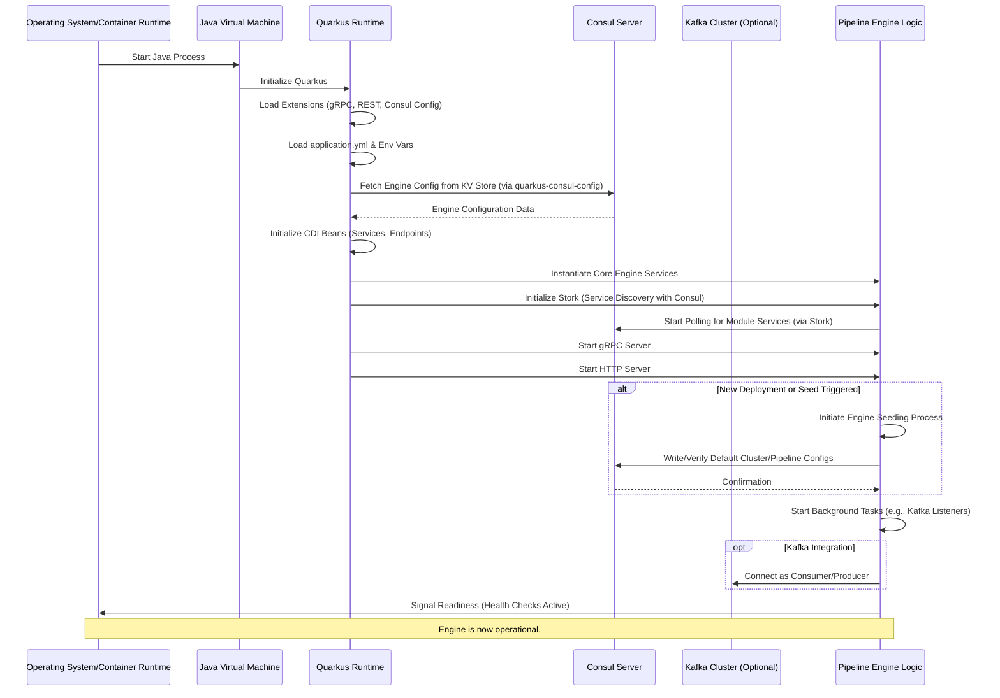
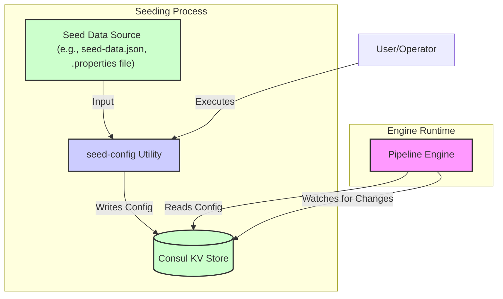

# Pipeline Engine: Initialization and Startup

The Pipeline Engine is designed to be deployable in various environments, including Docker containers, standalone Java applications, and Kubernetes clusters. Its initialization process involves several key stages, focusing on configuration loading, service discovery integration, and preparing for pipeline orchestration.

## Application Startup Sequence

The general startup sequence for the Pipeline Engine (typically a Quarkus application) is as follows:

1.  **JVM Initialization:** The Java Virtual Machine starts.
2.  **Quarkus Bootstrap:**
    *   Quarkus runtime initializes its core components.
    *   Extensions are loaded (e.g., gRPC, RESTeasy Reactive, Consul Config, Stork).
3.  **Configuration Loading (Multi-Source):**
    *   **`application.yml` (or `.properties`):** Base static configuration is loaded from the packaged application resources. This includes default ports, basic settings, and pointers to external configuration sources.
    *   **Environment Variables:** Environment variables can override settings from `application.yml`. This is common for deployment-specific parameters like database URLs, Consul host/port, etc.
    *   **Consul Configuration (`quarkus-consul-config`):** If enabled, Quarkus connects to the Consul KV store at the configured path (e.g., `pipeline/<cluster_name>/config`) and loads application-level configuration. This allows dynamic configuration of the engine itself.
        *   The engine might also load specific configurations it's responsible for managing, like whitelists or global settings, from other Consul paths.
4.  **Dependency Injection (CDI):** Quarkus initializes its CDI container, instantiating and injecting beans (services, resources, etc.). This includes:
    *   Core engine services (pipeline manager, execution engine).
    *   gRPC services (e.g., `ModuleRegistrationService`, `PipelineControlService`).
    *   REST API endpoints.
    *   Clients for external services (e.g., Consul client for service discovery via Stork, Kafka clients).
5.  **Service Discovery Initialization (Stork):**
    *   Stork, integrated with Quarkus, initializes its service discovery providers (e.g., Consul). It starts polling Consul for available instances of module services that the engine might need to communicate with.
6.  **gRPC Server Start:** The gRPC server embedded within the Pipeline Engine starts, listening on the configured port (e.g., `49000`) for incoming requests from modules or administrative tools.
7.  **HTTP Server Start:** The HTTP server (e.g., Vert.x based, part of Quarkus) starts, listening on its configured port (e.g., `38090`) for REST API calls and serving any web UI components.
8.  **Engine Seeding Process (Initial Configuration Setup):**
    *   This is a critical step, especially for new deployments or when bootstrapping a cluster. The engine might trigger or rely on an external `seed-config` utility.
    *   See "Engine Seeding Process" section below for details.
9.  **Background Processes Initialization:**
    *   The engine may start background tasks, such as:
        *   Monitoring configured Kafka topics for input documents.
        *   Periodically refreshing pipeline configurations from Consul (if not event-driven via watches).
        *   Health check monitors for critical dependencies.
10. **Application Ready:** The engine signals that it's ready to accept requests and orchestrate pipelines. Quarkus health check endpoints (`/q/health/live`, `/q/health/ready`) become active and report the engine's status.



## Deployment Environments

*   **Docker Environment:**
    *   The Pipeline Engine is packaged as a Docker image containing the Quarkus application JAR and necessary dependencies.
    *   `Dockerfile.jvm` (or native) defines how the image is built.
    *   Configuration is typically managed via:
        *   Environment variables passed to the Docker container (`docker run -e CONSUL_HOST=...`).
        *   Volume mounts for configuration files (less common for dynamic config but possible for bootstrap).
        *   Connection to an external Consul instance for dynamic configuration.
    *   Networking is configured to allow the engine to reach Consul, Kafka, and subsequently, the pipeline modules (which might also be Docker containers).

*   **Standalone Execution:**
    *   The engine can be run as a standard Java application: `java -jar pipeline-engine-quarkus-run.jar`.
    *   Configuration can be provided via:
        *   A local `application.yml` or `application.properties` file.
        *   Command-line arguments (`-Dquarkus.http.port=8081`).
        *   Environment variables.
        *   Connection to a Consul instance.
    *   This mode is often used for local development or smaller deployments where container orchestration is not required.

*   **Kubernetes (on any cloud):**
    *   The Docker image of the Pipeline Engine is deployed as a Kubernetes `Deployment` or `StatefulSet`.
    *   A Kubernetes `Service` exposes the engine's gRPC and HTTP ports.
    *   Configuration is managed using:
        *   Kubernetes `ConfigMaps` and `Secrets`, often mounted as files or environment variables. These can provide bootstrap configuration, including Consul addresses.
        *   Direct connection to a Consul cluster (which might also be running in Kubernetes or externally).
    *   Kubernetes handles health checks (liveness and readiness probes pointing to Quarkus health endpoints), restarts, and scaling of the engine instances.
    *   Service discovery within Kubernetes can complement Consul, or Consul can be the primary discovery mechanism, especially if modules are deployed across different environments or namespaces.

## Engine Seeding Process and Consul Configuration

The "seeding" process ensures that Consul has the necessary foundational configuration for the Pipeline Engine to operate, especially when a new cluster or environment is set up. This is often handled by the `engine/seed-config` utility.

1.  **Purpose of Seeding:**
    *   To initialize default `PipelineClusterConfig` for one or more clusters.
    *   To create placeholder or default `PipelineConfig` definitions.
    *   To set up any global engine settings or whitelists stored in Consul.
    *   To ensure the KV store structure expected by the engine exists.

2.  **`seed-config` Utility:**
    *   This is a command-line tool (likely a separate Quarkus application or script) that takes configuration data (e.g., from a `seed-data.json` or `.properties` file) and writes it to Consul.
    *   It connects to Consul using specified credentials and paths.
    *   It can create, update, or validate configurations in Consul.
    *   Refer to `DEVELOPER_NOTES/engine/seed-config/INSTRUCTIONS.md` for its usage.

3.  **How Config is Stored in Consul:**
    *   Configurations are stored as values (JSON, YAML, or properties format) under specific keys in the Consul KV store.
    *   **Example Structure:**
        *   `pipeline/` (root path for all Pipeline configurations)
            *   `default_cluster/` (a specific pipeline cluster)
                *   `cluster-config` (JSON/properties: `PipelineClusterConfig` for `default_cluster`)
                *   `pipelines/`
                    *   `my_first_pipeline` (JSON/properties: `PipelineConfig` for this pipeline)
                    *   `another_pipeline`
                *   `module_configs/` (optional, for shared module configurations)
                    *   `parser_default_settings`
            *   `another_cluster/`
                *   `...`
            *   `global/`
                *   `engine_settings` (e.g., global API keys, whitelists)

4.  **Integration with Engine Startup:**
    *   **Option 1 (Manual Seeding):** An operator runs the `seed-config` utility *before* starting the engine for the first time or when major configuration structures change.
    *   **Option 2 (Automated Seeding - Init Container/Job):** In Kubernetes, an `initContainer` or a `Job` could run the `seed-config` utility as part of the deployment process.
    *   **Option 3 (Engine-Triggered Seeding - Less Common for Full Seed):** The engine itself, on startup, might check for the existence of essential configurations and create defaults if they are missing. This is more suitable for minor self-healing or default value population rather than a full bootstrap.



## Potential for Quarkus Security Features

Quarkus offers robust built-in security features that can be integrated into the Pipeline Engine to enhance its security posture.

1.  **Authentication:**
    *   **Okta/OAuth2/OIDC:** Quarkus has excellent support for OpenID Connect, which can be used to secure REST APIs and potentially even gRPC services (e.g., by passing tokens in metadata). This would allow integration with identity providers like Okta, Keycloak, etc., for user authentication (e.g., for accessing the admin UI or control APIs).
        *   `quarkus-oidc` extension.
    *   **HTTP Basic/Form Authentication:** For simpler scenarios.
    *   **Mutual TLS (mTLS):** For securing gRPC and HTTP communication between services, ensuring both client and server authenticate each other.

2.  **Authorization (Fine-Grained Security):**
    *   **Role-Based Access Control (RBAC):** Define roles (e.g., `operator`, `admin`, `designer` as mentioned in the prompt) and associate permissions with these roles.
        *   Quarkus Security annotations (`@RolesAllowed`, `@Authenticated`) can protect JAX-RS (REST) endpoints and CDI beans.
        *   Custom security constraints can be implemented for more complex authorization logic.
    *   **Permissions:** Permissions can be defined for actions like:
        *   Creating/modifying/deleting pipelines.
        *   Deploying/undeploying modules.
        *   Viewing pipeline status.
        *   Accessing specific data within pipelines.
    *   **ACL-Based Systems Integration:** Quarkus security can be extended to integrate with external Access Control List (ACL) systems or policy engines (e.g., Open Policy Agent - OPA) by implementing custom `SecurityIdentityAugmentor` or `Permission` checkers.

3.  **Other Security Features:**
    *   **Cross-Origin Resource Sharing (CORS):** Essential if the Rokkon Engine serves a web frontend.
    *   **Cross-Site Request Forgery (CSRF) Prevention:** For web UIs.
    *   **Secure Communication (HTTPS/TLS):** Quarkus supports easy configuration of TLS for its HTTP and gRPC servers.
    *   **Data Encryption:** While not directly a Quarkus security feature for application logic, secure configurations (like API keys for modules) should be stored encrypted in Consul (using Consul's encryption capabilities or by encrypting values before storing) and decrypted by the engine or modules at runtime, potentially using Vault integration (Quarkus has a Vault extension).

**Example: Securing a REST Endpoint with Quarkus Security**
```java
import jakarta.ws.rs.GET;
import jakarta.ws.rs.Path;
import jakarta.ws.rs.Produces;
import jakarta.ws.rs.core.MediaType;
import jakarta.annotation.security.RolesAllowed;
import io.quarkus.security.identity.SecurityIdentity;
import jakarta.inject.Inject;

@Path("/api/pipelines")
public class PipelineResource {

    @Inject
    SecurityIdentity securityIdentity;

    @GET
    @RolesAllowed({"admin", "designer"}) // Only users with 'admin' or 'designer' role can access
    @Produces(MediaType.APPLICATION_JSON)
    public String listPipelines() {
        // Logic to list pipelines
        // Access user info: securityIdentity.getPrincipal().getName();
        return "[\"pipeline1\", \"pipeline2\"]";
    }

    @POST
    @RolesAllowed({"admin"}) // Only 'admin' can create pipelines
    public void createPipeline(String pipelineConfig) {
        // Logic to create a pipeline
    }
}
```

## Further Reading

*   **Pipeline Design (`Pipeline_design.md`):** Understand the structure of pipelines and configurations that are initialized and managed.
*   **Module Deployment (`Module_deployment.md`):** Details how modules are registered, which is relevant to the service discovery aspect of initialization.
*   **Quarkus Documentation:**
    *   Quarkus Guides on Consul Config, gRPC, REST, Security (OIDC, RBAC), Stork.
    *   Quarkus deployment guides for Docker and Kubernetes.
*   **Consul Documentation:** For understanding KV store interaction and service discovery mechanisms.
*   **`DEVELOPER_NOTES/engine/seed-config/README.md`:** For specifics on the seeding utility.

By combining Quarkus's robust application framework with Consul's service discovery and configuration management capabilities, the Pipeline Engine can achieve a flexible and reliable initialization process across diverse deployment environments, with strong potential for integrating advanced security features.
