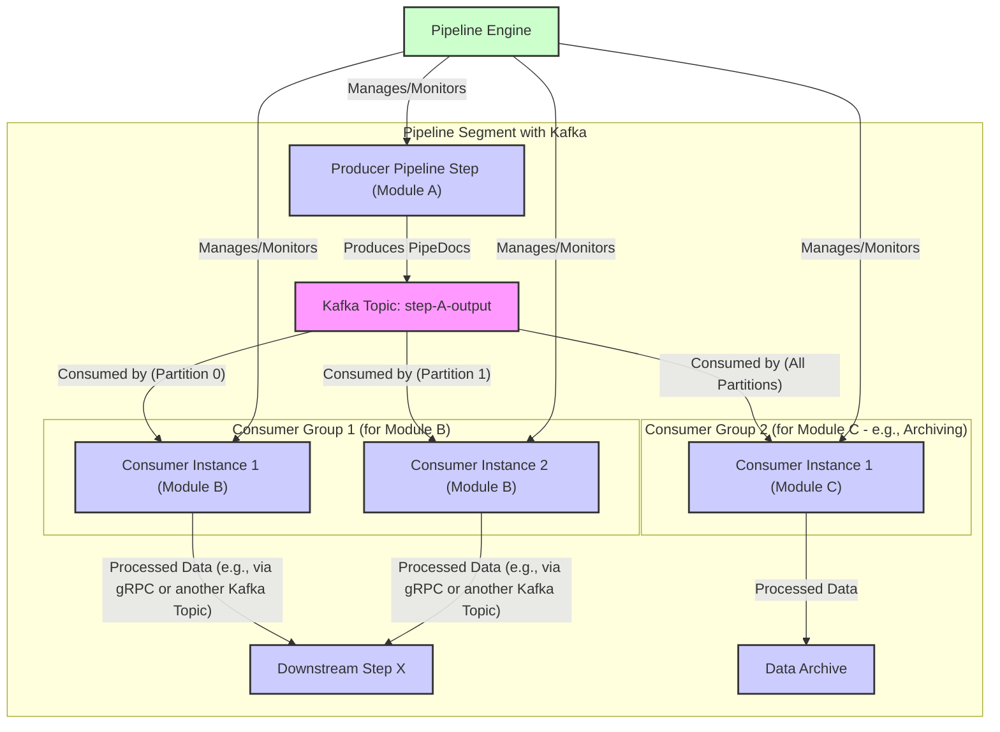
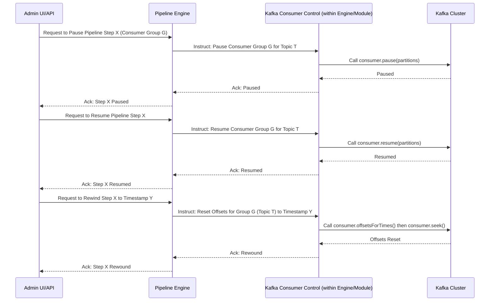
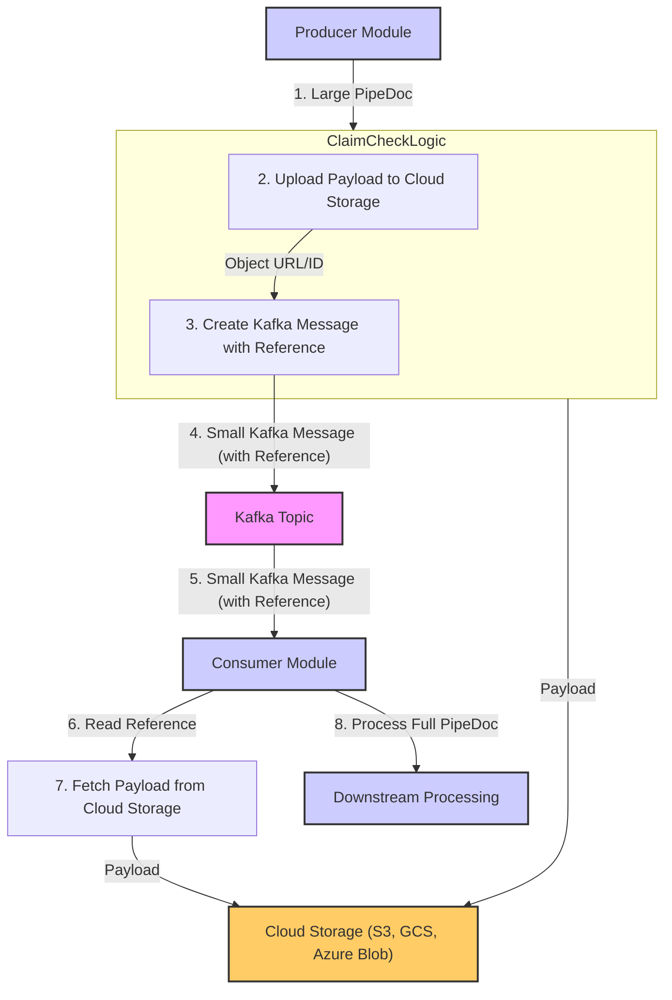

# Pipeline Engine: Kafka Integration

Apache Kafka plays a vital role in the Pipeline Engine ecosystem, primarily as a high-throughput, fault-tolerant, and scalable messaging system for asynchronous communication between pipeline steps. This allows for decoupling of services, buffering of data, and enabling complex data flow patterns.

## Role of Kafka in Application Pipelines

1.  **Asynchronous Communication:** Pipeline steps can produce data to Kafka topics and other steps can consume from these topics independently. This decouples the producer from the consumer, meaning they don't need to be available at the same time or process data at the same rate.
2.  **Buffering and Durability:** Kafka topics act as persistent buffers. If a consumer module is slow, down for maintenance, or experiences a temporary load spike, messages remain in Kafka until they can be processed. This prevents data loss and improves overall pipeline resilience.
3.  **Fan-out and Fan-in:**
    *   **Fan-out:** A single pipeline step can produce messages to a Kafka topic, and multiple different consumer steps (belonging to the same or different consumer groups) can read from that topic to process the data in parallel or for different purposes.
    *   **Fan-in:** Multiple producer steps can write to the same Kafka topic, allowing a consumer step to process aggregated data from various sources.
4.  **Load Balancing:** When multiple instances of a consumer module are part of the same Kafka consumer group, Kafka automatically distributes topic partitions among them, effectively load-balancing the data processing.
5.  **Data Replayability (Rewind):** Kafka retains messages for a configurable period. This allows for reprocessing of data by resetting a consumer group's offset to an earlier point in time, which is invaluable for debugging, recovery from errors, or applying updated processing logic to historical data.

## Dynamic Listeners and Topic Management

The Pipeline Engine aims to manage Kafka listeners and topics dynamically based on pipeline configurations.

1.  **Dynamic Listener Creation:**
    *   When a pipeline is defined or updated with a step that consumes from a Kafka topic, the Pipeline Engine (or the module itself, if it's designed to be self-configuring based on engine directives) needs to start a Kafka consumer listening to the specified topic(s).
    *   Quarkus provides robust support for Apache Kafka client integration (`quarkus-kafka-client`), including reactive messaging connectors (`quarkus-smallrye-reactive-messaging-kafka`) that facilitate dynamic consumer management.
    *   The engine can create and manage these listeners at runtime, associating them with the correct pipeline step logic and consumer group.

2.  **Topic Naming Conventions and Configuration:**
    *   Pipeline configurations stored in Consul will specify input and output Kafka topics for relevant steps.
    *   Example: A `PipelineStepConfig` might have `input_kafka_topic: "parsed-documents-topic"` and `output_kafka_topics: ["embedded-text-topic", "raw-for-logging-topic"]`.
    *   The engine reads these configurations and ensures that producers send to the correct output topics and consumers listen to the correct input topics.

3.  **Topic Auto-Creation (Optional):**
    *   Kafka brokers can be configured to auto-create topics when a producer first tries to send to a non-existent topic, or when a consumer tries to subscribe.
    *   While convenient for development, in production, it's often preferred to manage topic creation explicitly (e.g., via administrative tools or scripts) to control partitioning, replication factor, and other settings. Pipeline might provide utilities or integrate with tools for this.

4.  **Pushing to Any Allowed Kafka Topic:**
    *   A producing pipeline step, based on its configuration or runtime logic, can be directed to publish messages to any Kafka topic it has permissions to write to. These permissions are typically managed through Kafka ACLs or by the Pipeline Engine's internal configuration, ensuring secure and controlled data flow. This flexibility is crucial for dynamic routing, A/B testing (sending data to different topics for different processing paths), or conditional data forwarding.

## Processing Control Capabilities

Effective pipeline management requires control over Kafka message consumption.

1.  **Pause/Resume Processing:**
    *   Kafka consumers can be paused and resumed. The Pipeline Engine can expose controls (e.g., via API or UI) to pause consumption for a specific pipeline step or an entire pipeline that uses Kafka.
    *   This is useful for:
        *   Performing maintenance on downstream systems.
        *   Investigating issues without new data flowing in.
        *   Managing resource utilization.
    *   The `KafkaConsumer.pause()` and `KafkaConsumer.resume()` methods are used for this. Reactive messaging frameworks often provide higher-level abstractions.

2.  **Stop Processing:**
    *   Stopping processing for a Kafka-consuming step involves shutting down its Kafka consumer(s) gracefully, ensuring any in-flight messages are processed and offsets are committed.
    *   This is part of undeploying or disabling a pipeline or step.

3.  **Rewind Processing (Offset Management):**
    *   To reprocess data, a consumer group's current offset for a topic/partition needs to be reset to an earlier position.
    *   This can be done using Kafka's administrative tools (`kafka-consumer-groups.sh --reset-offsets`) or programmatically via the `KafkaConsumer.seek()` method or similar functionalities in Kafka client libraries.
    *   The Pipeline Engine could provide an interface to trigger offset resets for specific consumer groups associated with pipeline steps, potentially based on timestamps or specific offset values.
    *   Care must be taken when rewinding, especially with stateful processing or side effects, to ensure idempotency or handle duplicates appropriately.

## Overcoming Message Size Limits with Cloud Storage

Many cloud-based Kafka implementations (e.g., Amazon MSK with default configurations, Confluent Cloud with certain tiers) and even self-managed Kafka clusters have practical limits on message size (e.g., default 1MB, often configurable up to around 8-10MB after compression, but larger messages can strain brokers). Large documents, images, or complex `PipeDoc` objects can exceed these limits.

Pipeline plans to address this using the **Claim Check pattern**:

1.  **The Problem:** A `PipeDoc` containing a large binary (e.g., a PDF, a high-resolution image, a large text corpus) might be too big for a Kafka message.
2.  **The Solution (Claim Check Pattern):**
    *   Instead of placing the large data directly into the Kafka message, the producing pipeline step first uploads the large data payload to a shared, scalable cloud storage service (e.g., AWS S3, Google Cloud Storage, Azure Blob Storage, MinIO).
    *   The producer then sends a much smaller Kafka message (the "claim check") containing a *reference* or pointer to the data in cloud storage (e.g., the S3 bucket and object key).
    *   The consuming pipeline step receives this small Kafka message, reads the reference, and then fetches the actual large data payload directly from the cloud storage service.

**Benefits of the Claim Check Pattern:**

*   **Keeps Kafka messages small:** This ensures Kafka operates efficiently and avoids hitting message size limits.
*   **Leverages scalable storage:** Cloud storage services are designed for large objects and high throughput.
*   **Cost-effective for large data:** Storing large data in dedicated object storage is often more cost-effective than trying to buffer it all in Kafka brokers for extended periods.
*   **Selective data retrieval:** Consumers can potentially decide whether to fetch the large payload based on metadata in the claim check message, though typically they would always fetch it.

**Considerations:**

*   **Increased Latency:** There's an extra step of fetching data from cloud storage, which adds latency compared to having data directly in the Kafka message.
*   **Complexity:** The system needs to manage access to cloud storage (credentials, permissions) and handle potential failures in uploading or downloading data.
*   **Lifecycle Management:** Policies for deleting data from cloud storage once it's no longer needed by any consumer must be implemented to avoid orphaned data and control costs. This could be time-based or acknowledgement-based.

The Pipeline Engine will need to provide clear conventions or helper libraries/SDKs for modules to implement the claim check pattern easily, including configuration for storage endpoints and credentials.

## Further Reading

*   **Pipeline Design (`Pipeline_design.md`):** For how Kafka topics are specified in pipeline configurations.
*   **Module Deployment (`Module_deployment.md`):** Modules acting as Kafka consumers/producers are deployed as part of the pipeline.
*   **Quarkus Kafka Client Guide:** For details on how Kafka integration is implemented in Quarkus-based components of Pipeline.
*   **SmallRye Reactive Messaging Kafka Documentation:** For advanced reactive Kafka integration patterns.
*   **Apache Kafka Documentation:** For core Kafka concepts like topics, partitions, consumer groups, and offset management.
*   **Enterprise Integration Patterns (Claim Check):** For more on the Claim Check pattern.
