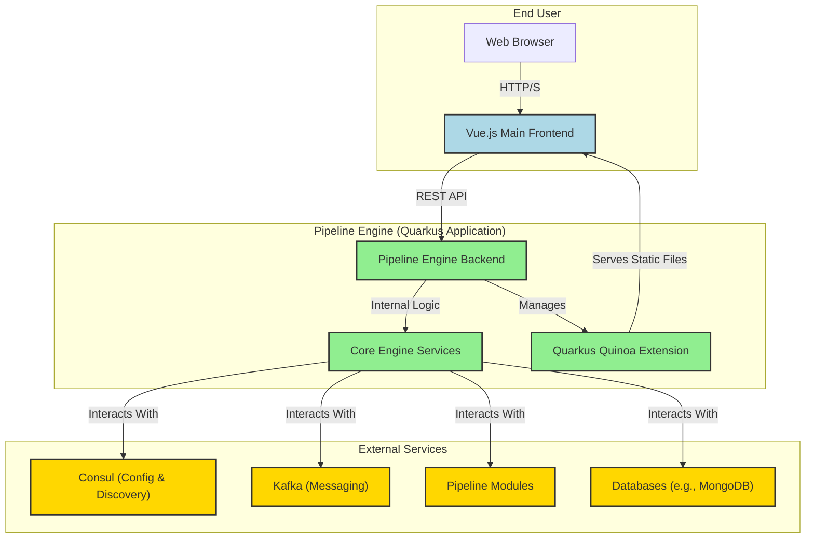

# Pipeline Engine: Main Frontend Architecture

## Introduction

This document outlines the architectural plan for the main, production-ready frontend for the Pipeline Engine. This frontend will be a modern, interactive web application built with Vue.js, designed to provide a comprehensive interface for managing and interacting with the Pipeline Engine's core functionalities. It will be developed as a standalone Node.js project, integrated with the Quarkus backend using the Quarkus Quinoa extension for seamless bundling and serving.

## Goals

*   **User-Friendly Interface:** Provide an intuitive and responsive web interface for all non-development related Pipeline Engine operations.
*   **Modern Technology Stack:** Utilize Vue.js for the frontend, ensuring a contemporary and maintainable codebase.
*   **API-Driven:** Consume the Pipeline Engine's REST APIs (with consideration for future gRPC API consumption) as the primary means of communication.
*   **Seamless Integration:** Leverage Quarkus Quinoa for efficient development, building, and serving of the frontend alongside the Quarkus backend.
*   **Separation of Concerns:** Clearly separate the main production frontend from development-only tooling (which will reside in the Quarkus Dev UI).
*   **Scalable Development:** Enable independent development by frontend specialists, treating the frontend as a distinct Node.js project.

## Architectural Overview

The main frontend will operate as a Single Page Application (SPA) served by the Pipeline Engine's Quarkus backend. Communication will primarily be via REST APIs, with a forward-looking view towards gRPC integration.

## Frontend Development (Vue.js as a "Real Node Project")

1.  **Project Setup:** The Vue.js application will be initialized as a standard Node.js project (e.g., using Vue CLI or Vite). It will have its own `package.json`, dependencies, and build scripts.
2.  **Development Workflow:**
    *   Frontend developers will work on the Vue.js project using standard Node.js development tools (e.g., `npm run serve` for a local dev server).
    *   During development, the Vue.js dev server will run independently, and the Quarkus backend will proxy API requests to the appropriate endpoints.
    *   Quinoa's live coding support will enable simultaneous development of frontend and backend.
3.  **Build Process:** The Vue.js project will have a standard build script (e.g., `npm run build`) that compiles the Vue.js components into static HTML, CSS, and JavaScript assets.

## API Consumption

1.  **REST APIs:** The primary communication between the Vue.js frontend and the Pipeline Engine backend will be via RESTful APIs. These APIs will expose functionalities for:
    *   Pipeline management (create, read, update, delete, deploy, undeploy, start, stop, pause, resume).
    *   Module listing and status.
    *   Monitoring data (metrics, logs).
    *   User and role management (if applicable).
2.  **Future gRPC Integration:** While initial communication will be REST-based, the architecture should anticipate future gRPC integration for performance-critical or streaming data scenarios. This would involve:
    *   Generating gRPC-Web compatible client stubs from the Pipeline Engine's `.proto` definitions.
    *   Using a gRPC-Web proxy (e.g., Envoy, or a Quarkus gRPC-Web extension) to translate gRPC-Web calls from the browser to gRPC calls to the backend.
    *   The frontend would then use these generated stubs to make gRPC calls.
3.  **Data Contracts:** Clear and well-documented API contracts (e.g., OpenAPI/Swagger for REST, Protocol Buffers for gRPC) will be essential for efficient collaboration between frontend and backend teams.

## Quarkus Quinoa Integration

Quarkus Quinoa will facilitate the integration of the Vue.js frontend with the Quarkus backend:

1.  **Project Location:** The Vue.js project will likely reside in a dedicated directory within the main Pipeline Engine module (e.g., `engine/pipestream/src/main/webui` or a new submodule like `engine/main-ui`).
2.  **Development Mode (`quarkus dev`):** Quinoa will automatically start the Vue.js dev server and proxy requests, enabling a unified live-coding experience.
3.  **Production Build (`quarkus build`):** Quinoa will execute the Vue.js build process and bundle the resulting static assets directly into the Quarkus application's JAR. This creates a single, self-contained deployable unit.
4.  **Serving Static Assets:** Quinoa will configure Quarkus to serve the bundled frontend assets, making the web application accessible via the Pipeline Engine's HTTP server.

## Deployment Considerations

*   **Single Deployable Unit:** The use of Quinoa means the frontend and backend are bundled into a single JAR, simplifying deployment to various environments (Docker, Kubernetes, standalone).
*   **CDN/External Hosting (Optional):** For very large-scale deployments or specific performance requirements, the static frontend assets could optionally be served from a Content Delivery Network (CDN) or a separate static file host, with the backend serving only the APIs. This would involve configuring Quinoa to output the build artifacts to a separate location.

## Security Considerations

Security will be paramount for the main frontend:

*   **Authentication & Authorization:** Implement robust authentication (e.g., OAuth2/OIDC) and role-based access control (RBAC) for all API endpoints. The frontend will integrate with the Pipeline Engine's security mechanisms.
*   **Secure Communication:** All communication between the browser and the backend must use HTTPS/TLS.
*   **Input Validation:** Frontend input will be validated, and backend APIs will perform server-side validation to prevent malicious inputs.
*   **Cross-Site Scripting (XSS) & Cross-Site Request Forgery (CSRF) Protection:** Standard web security practices will be applied.

## Conclusion

The new main frontend, built with Vue.js and seamlessly integrated via Quarkus Quinoa, will provide a powerful and intuitive interface for managing the Pipeline Engine. By adhering to API-driven development, leveraging modern frontend practices, and ensuring robust security, this architecture will enable efficient development and a superior user experience for the Pipeline Engine's production operations.
