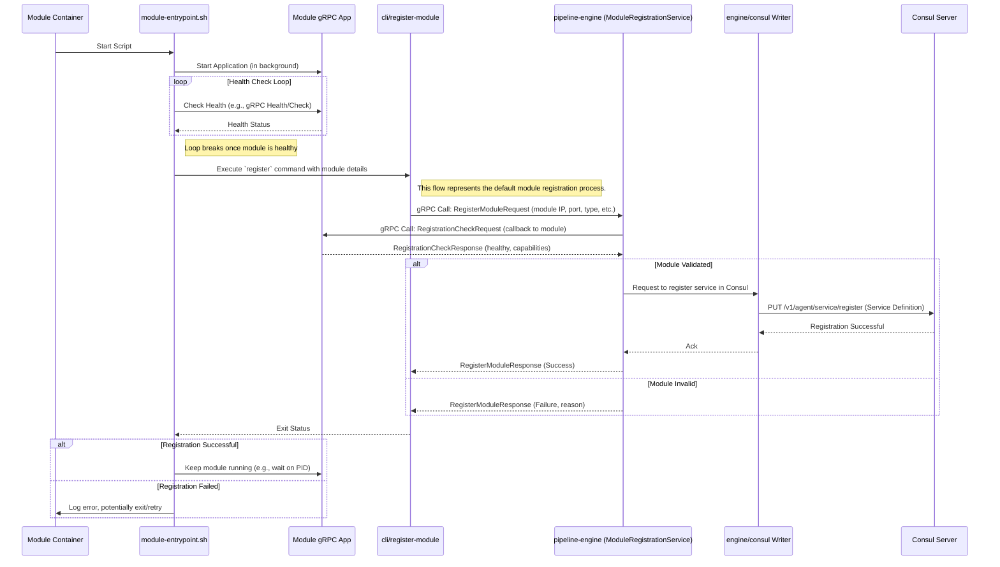

# Pipeline Engine: Module Deployment and Registration

Modules are the core workhorse components in the Pipeline Engine, performing tasks like data ingestion (connectors), transformation (pipeline steps), and loading (sinks). Deploying and registering these modules correctly is crucial for the engine to discover and utilize them in pipelines.

## Module Deployment Process

Modules are typically packaged as Docker containers, each running a gRPC service that implements the Pipeline `PipeStepProcessor` interface (and potentially other required interfaces).

1.  **Development and Packaging:**
    *   Developers create a module in any gRPC-supported language (Java/Quarkus, Python, Go, Node.js, etc.).
    *   The module implements the necessary gRPC services defined in `commons/protobuf`.
    *   A `Dockerfile` is created to package the module application, its dependencies, and any necessary startup scripts.
    *   Common practice includes:
        *   Exposing the module's gRPC port (e.g., `9090`).
        *   Setting up an entrypoint script (e.g., `module-entrypoint.sh`) that starts the gRPC service.

2.  **Building the Docker Image:**
    *   The module's Docker image is built (e.g., `docker build -t pipeline/python-parser-module:v1.2 .`).
    *   For Java/Quarkus modules, this often involves a multi-stage build (e.g., using `Dockerfile.jvm` or `Dockerfile.native`).
    *   The build process might also include copying shared scripts or CLI tools (like `pipeline-cli.jar`) into the image, as described in `DEVELOPER_NOTES/modules/README-registration.md`.

3.  **Pushing to a Container Registry:**
    *   The built Docker image is pushed to a container registry accessible by the deployment environment (e.g., Docker Hub, AWS ECR, Google GCR, Azure ACR, or a private registry like `nas.pipeline.com:5000` mentioned in `application.yml`).
    *   Example: `docker push pipeline/python-parser-module:v1.2`

4.  **Deployment to an Execution Environment:**
    *   **Docker Host:** `docker run -d -p 9090:9090 --name parser-instance-1 -e ENGINE_HOST=krick.pipeline.com pipeline/python-parser-module:v1.2`
    *   **Kubernetes:** A Kubernetes `Deployment` manifest is created:
        ```yaml
        apiVersion: apps/v1
        kind: Deployment
        metadata:
          name: python-parser-deployment
        spec:
          replicas: 3 # Example: 3 instances of the parser module
          selector:
            matchLabels:
              app: python-parser
          template:
            metadata:
              labels:
                app: python-parser
                moduleType: parser # Custom label for easier discovery/management
            spec:
              containers:
              - name: python-parser-container
                image: pipeline/python-parser-module:v1.2
                ports:
                - containerPort: 9090 # gRPC port
                env:
                - name: MODULE_PORT
                  value: "9090"
                - name: ENGINE_HOST
                  value: "pipeline-engine-service.pipeline-namespace.svc.cluster.local" # K8s service name for engine
                - name: ENGINE_PORT
                  value: "49000" # Engine's gRPC registration port
                - name: CONSUL_HOST
                  value: "consul-service.consul-namespace.svc.cluster.local" # For direct Consul registration if used
                # Add other necessary environment variables for the module
                # (e.g., API keys, model paths, specific configurations)
                readinessProbe: # Example gRPC health probe
                  grpc:
                    port: 9090
                    service: grpc.health.v1.Health # Standard gRPC health check
                  initialDelaySeconds: 5
                  periodSeconds: 10
                livenessProbe:
                  grpc:
                    port: 9090
                    service: grpc.health.v1.Health
                  initialDelaySeconds: 15
                  periodSeconds: 20
        ```
    *   A Kubernetes `Service` might also be created to expose the module instances, though often the engine discovers individual pod IPs via Consul.

## Module Registration with Consul

Once a module container starts, it must register itself with the Pipeline Engine and/or Consul so it can be discovered and utilized in pipelines. The primary mechanism for this involves the module announcing its presence and capabilities.

**Role of the Engine CLI (`cli/register-module`) / Entrypoint Script:**

As outlined in `DEVELOPER_NOTES/modules/README-registration.md`, an automated registration process is often facilitated by an entrypoint script (`module-entrypoint.sh`) within the module's container and a CLI tool (`pipeline-cli.jar`).

1.  **Module Application Startup:** The entrypoint script first starts the module's main gRPC application in the background.
    ```bash
    # module-entrypoint.sh (simplified)
    echo "Starting module application..."
    java -jar /deployments/my-module-app.jar & # Or python /app/main.py &
    MODULE_PID=$!
    ```

2.  **Health Check Wait:** The script waits for the module's gRPC service to become healthy. This is often done by polling a standard gRPC health check endpoint (`grpc.health.v1.Health/Check`) or a custom health endpoint on the module.
    ```bash
    # module-entrypoint.sh (simplified)
    # Wait for module to be healthy (e.g., using grpcurl or custom script)
    until grpcurl -plaintext localhost:${MODULE_PORT:-9090} grpc.health.v1.Health/Check ...; do
      echo "Module not healthy yet, waiting..."
      sleep 5
    done
    ```

3.  **Registration via `cli/register-module`:** Once healthy, the script calls the `pipeline-cli register` command.
    ```bash
    # module-entrypoint.sh (simplified)
    echo "Registering module with engine..."
    java -jar /deployments/pipeline-cli.jar register \
      --module-host ${MODULE_CONTAINER_IP:-$(hostname -i)} \
      --module-port ${MODULE_PORT:-9090} \
      --module-type ${MODULE_TYPE:-"generic-module"} \
      --module-version ${MODULE_VERSION:-"1.0.0"} \
      --engine-host ${ENGINE_HOST} \
      --engine-port ${ENGINE_REGISTRATION_PORT:-49000} # Port for ModuleRegistrationService on engine
      # Potentially other parameters like --service-name, --tags, etc.
    ```
    *   The `pipeline-cli register` command is a client application that communicates with a `ModuleRegistrationService` (or a similar endpoint) hosted by the Pipeline Engine.

4.  **Pipeline Engine's `ModuleRegistrationService`:**
    *   This gRPC service on the Pipeline Engine receives the registration request from the `pipeline-cli`.
    *   **Validation:** It performs validation:
        *   Is the module type whitelisted or recognized?
        *   Does the module respond to a `RegistrationCheck` RPC call to verify its basic functionality and advertised capabilities? (The engine calls back to the module's `RegistrationCheck` gRPC method).
        *   Are required parameters present?
    *   **Consul Registration (Handled by Engine):** If validation passes, the Pipeline Engine (specifically, its `engine-consul` component, which is the sole writer to Consul) registers the module instance as a service in Consul. This includes:
        *   Service Name (e.g., `parser-module`, `embedder-v2-text`).
        *   Service ID (unique for each instance, e.g., `parser-module-instance-abc123`).
        *   IP Address and Port of the module instance.
        *   Tags (e.g., `module-type:parser`, `version:1.2`, `pipeline-module`).
        *   Health Check Configuration for Consul (e.g., a gRPC health check pointing to the module's health service).

5.  **Direct Consul Registration (Discovery Path):**
    *   Modules or operators can also register services *directly* with Consul using Consul's HTTP API or a Consul client library. This path makes the module discoverable by Consul, but it **bypasses the Pipeline Engine's `ModuleRegistrationService` validation and acceptance process.** Such modules are visible in Consul but are not automatically integrated into the Pipeline Engine's active set of processing units.
    *   **Dashboard Onboarding for Acceptance:** For modules discovered via direct Consul registration, the Pipeline Engine dashboard provides an option to "onboard" or "accept" them into the running application. This process involves registering the module's necessary metadata (e.g., schema, capabilities) with the Pipeline Engine's configuration. Only after this explicit onboarding step will the module be considered an active and validated participant in pipeline execution.

**Diagram of Registration Flow (Engine-Mediated):**



## How This Ties Together with Consul

*   **Service Discovery:** Once registered in Consul, the module instance becomes discoverable by the Pipeline Engine (using Stork with Consul service discovery) and potentially other services. The engine uses this discovery to route `PipeDoc` traffic to healthy, available module instances when executing pipeline steps.
*   **Health Monitoring:** Consul actively monitors the health of registered module instances using the configured health checks. If an instance becomes unhealthy, Consul marks it as such, and the Pipeline Engine will stop sending traffic to it.
*   **Dynamic Scaling:** If more instances of a module are deployed (e.g., by scaling a Kubernetes Deployment), each new instance runs the entrypoint script and registers itself. Consul and the Pipeline Engine automatically become aware of the increased capacity. Similarly, when instances are terminated, they should ideally deregister from Consul (Kubernetes can also help with this via preStop hooks or Consul lifecycle management tools like `consul-k8s`).
*   **Configuration Source (Optional for Modules):** While the engine reads pipeline configurations from Consul, individual modules *can* also be designed to read their own specific, fine-grained configurations from Consul if needed, though often step-specific parameters are passed by the engine during the `ProcessData` call.

This deployment and registration mechanism ensures that the Pipeline Engine has an up-to-date view of all available processing resources, enabling it to dynamically orchestrate complex data pipelines. The use of a CLI tool and entrypoint script standardizes the registration process for modules, regardless of the language they are written in.

## Further Reading

*   **Initialization (`Initialization.md`):** Describes how the Pipeline Engine itself starts and interacts with Consul.
*   **Pipeline Design (`Pipeline_design.md`):** Explains how modules fit into the logical pipeline structure.
*   **`DEVELOPER_NOTES/modules/README-registration.md`:** Provides specific instructions and context for the automated module registration setup.
*   **`pipeline-engine/README.md` and `engine/consul/README.md`:** Detail the engine's role and its interaction with Consul, emphasizing the centralized write model.
*   **Consul Documentation on Services and Health Checks.**
*   **Kubernetes Documentation on Deployments, Services, and Probes.**
*   **gRPC Health Checking Protocol documentation.**
