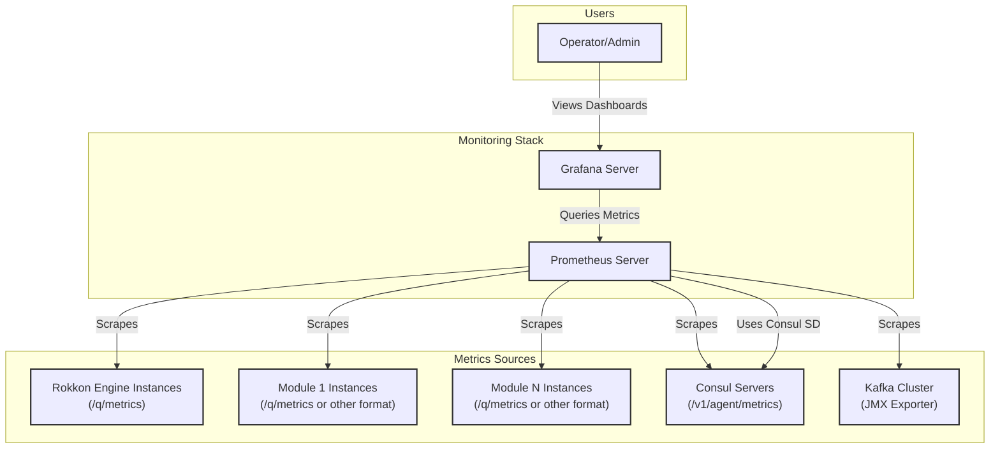
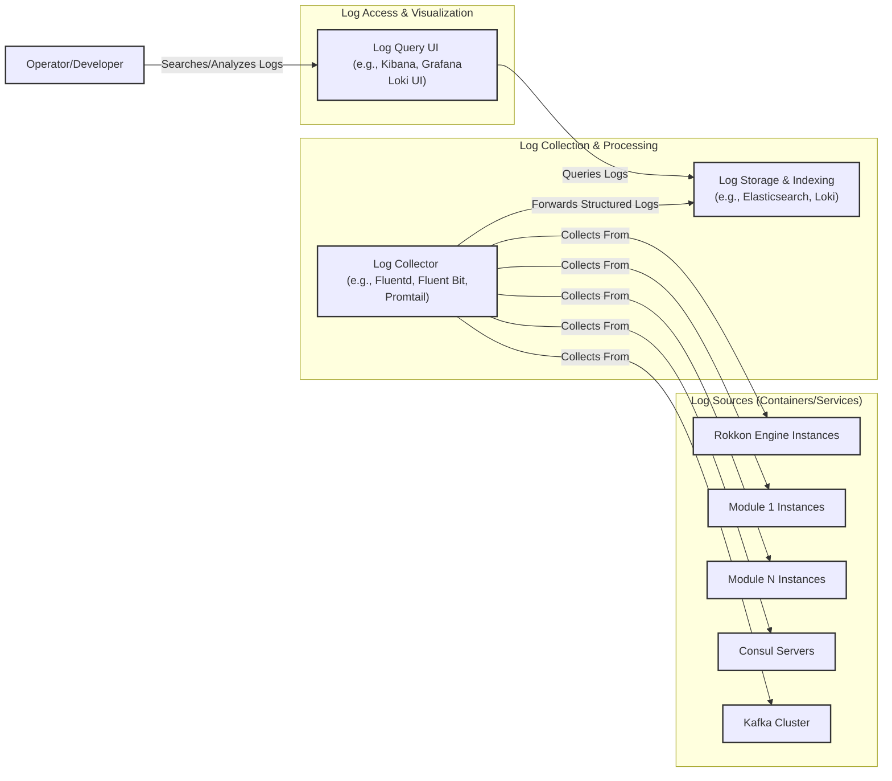

# Rokkon Engine: Monitoring and Operations Logging

Effective monitoring and comprehensive logging are essential for understanding the behavior of the Rokkon Engine and its pipelines, troubleshooting issues, and ensuring operational stability. The strategy involves leveraging Quarkus's built-in capabilities, integrating with standard monitoring tools like Prometheus and Grafana, and implementing advanced logging practices.

## Monitoring Strategy

The monitoring approach focuses on collecting metrics from various components of the Rokkon ecosystem and visualizing them through dashboards.

### 1. Prometheus for Metrics Collection

*   **Quarkus Micrometer Extension:** Quarkus applications (Rokkon Engine, Java-based modules) will use the Micrometer extension (`quarkus-micrometer-registry-prometheus`). Micrometer provides a vendor-neutral application metrics facade.
    *   This extension automatically exposes a `/q/metrics` endpoint that Prometheus can scrape.
    *   It provides various built-in metrics:
        *   JVM metrics (memory, CPU, threads, GC).
        *   HTTP server/client metrics (request counts, latency, errors).
        *   gRPC client/server metrics.
        *   Kafka consumer/producer metrics.
        *   CDI bean metrics.
*   **Custom Application Metrics:** Rokkon Engine and modules will define custom Micrometer metrics to track business-specific information:
    *   `pipedocs_processed_total{pipeline_id, step_id, status}`: Counter for processed PipeDocs.
    *   `pipedoc_processing_time_seconds{pipeline_id, step_id}`: Histogram/Timer for processing duration.
    *   `pipeline_errors_total{pipeline_id, step_id, error_type}`: Counter for errors.
    *   `kafka_message_lag{topic, group_id, partition}`: Gauge for Kafka consumer lag.
    *   `module_instance_active_count{module_type}`: Gauge for active module instances.
    *   `consul_kv_watch_events_total{key_path}`: Counter for Consul configuration change events.
*   **Prometheus Server:** A Prometheus server will be deployed to scrape these `/q/metrics` endpoints from:
    *   Rokkon Engine instances.
    *   Individual pipeline module instances (if they expose Prometheus metrics, which is straightforward for Quarkus-based modules).
    *   Consul (Consul itself exposes metrics in Prometheus format).
    *   Kafka (Kafka brokers and ZooKeeper can be configured to expose JMX metrics, which can be exported to Prometheus via JMX Exporter).
*   **Service Discovery for Scraping:** Prometheus can be configured to use Consul for service discovery to find and scrape metrics from dynamically scaled Rokkon Engine and module instances.

### 2. Grafana for Visualization and Dashboards

*   Grafana will be used as the visualization layer, with Prometheus as its primary data source.
*   **Dashboards:** Custom Grafana dashboards will be created to provide insights into:
    *   **Engine Overview:** Health, resource usage, overall throughput, error rates of the Rokkon Engine instances.
    *   **Pipeline Performance:** End-to-end latency, throughput, error rates per pipeline. Drill-downs into individual step performance.
    *   **Module Health & Performance:** Resource usage (CPU, memory), processing rates, error rates per module type and instance.
    *   **Kafka Monitoring:** Broker health, topic message rates, consumer lag, partition distribution.
    *   **Consul Monitoring:** Cluster health, KV store access rates, service health status.
    *   **Resource Utilization:** JVM metrics, system-level metrics from hosts/pods.

### 3. Alerting

*   Prometheus Alertmanager will be configured to send alerts based on predefined rules.
*   **Alert Examples:**
    *   High error rates in a pipeline or step.
    *   Significant Kafka consumer lag.
    *   Low disk space on Kafka brokers.
    *   Unhealthy module instances detected by Consul.
    *   Rokkon Engine instance down.
    *   High resource utilization (CPU, memory).
*   Alerts can be routed to various notification channels (Email, Slack, PagerDuty, etc.).

## Advanced Logging

Comprehensive and structured logging is crucial for debugging and auditing.

1.  **Structured Logging:**
    *   Applications (Engine, Modules) will use structured logging, outputting logs in JSON format. This makes logs easier to parse, search, and analyze by log management systems.
    *   Quarkus can be configured for JSON logging (e.g., using `quarkus-logging-json`).
    *   Key information to include in log entries:
        *   Timestamp
        *   Log level (INFO, WARN, ERROR, DEBUG)
        *   Service name (e.g., `rokkon-engine`, `parser-module`)
        *   Instance ID / Hostname
        *   Thread name
        *   **Correlation ID (`trace_id`, `span_id`):** Essential for tracing a request or `PipeDoc` as it flows through multiple services/steps.
        *   `pipeline_id`, `step_id`, `document_id`: Contextual information for Rokkon.
        *   Message
        *   Stack trace (for errors)

2.  **Log Collection and Aggregation:**
    *   Logs from all Rokkon Engine instances, module instances, Consul, and Kafka will be collected and aggregated into a centralized log management system.
    *   Common choices:
        *   **ELK Stack (Elasticsearch, Logstash, Kibana):** Elasticsearch for storage and search, Logstash for parsing and enrichment (or Fluentd/Fluent Bit for collection), Kibana for visualization and querying.
        *   **Loki with Grafana:** Grafana Loki is a horizontally scalable, highly available, multi-tenant log aggregation system, designed to be cost-effective and easy to operate. It integrates well with Prometheus and Grafana.
        *   Cloud-native solutions (AWS CloudWatch Logs, Google Cloud Logging, Azure Monitor Logs).
    *   Container orchestrators like Kubernetes often have built-in mechanisms for log collection from pods.

3.  **Distributed Tracing (Future Consideration, but influences logging):**
    *   For deep insights into request flows across microservices, distributed tracing tools (Jaeger, Zipkin, OpenTelemetry) are invaluable.
    *   Quarkus has OpenTelemetry support (`quarkus-opentelemetry`).
    *   When implemented, trace IDs and span IDs generated by the tracing system should be included in structured logs to correlate logs with traces.

## Quarkus Friendly Features for Monitoring & Logging

Quarkus provides several features that aid in monitoring and logging:

*   **Health Checks (`quarkus-smallrye-health`):**
    *   Exposes `/q/health`, `/q/health/live`, `/q/health/ready` endpoints.
    *   Liveness probes indicate if the application is running.
    *   Readiness probes indicate if the application is ready to accept requests.
    *   Custom health checks can be implemented to verify dependencies (e.g., connection to Consul, Kafka, database).
    *   Kubernetes uses these endpoints for pod health management.
*   **Metrics (`quarkus-micrometer-registry-prometheus`):** As discussed, for exposing Prometheus metrics.
*   **OpenTelemetry (`quarkus-opentelemetry`):** For distributed tracing, which can be correlated with logs.
*   **Structured Logging Support:** Extensions like `quarkus-logging-json` or `quarkus-logging-gelf` facilitate structured logging.
*   **Configuration:** All these features are configurable via `application.yml` (or `.properties`).
*   **Dev UI:** The Quarkus Dev UI provides insights into CDI beans, configuration, metrics, and health checks during development, which helps in setting up monitoring correctly.

## Future Connectors, Sinks, and Pipelines Planned

While the current focus is on building the core engine, the architecture is designed to easily accommodate a wide range of future integrations. The monitoring and logging system should be flexible enough to incorporate metrics and logs from these new components.

*(Refer to `Planned_integrations.md` for a detailed list of planned connectors, pipeline steps, and sinks.)*

By implementing a robust monitoring and logging strategy using tools like Prometheus, Grafana, and a centralized logging solution, operators will have the necessary visibility to manage the Rokkon Engine effectively, diagnose problems quickly, and ensure the reliability and performance of data pipelines.
