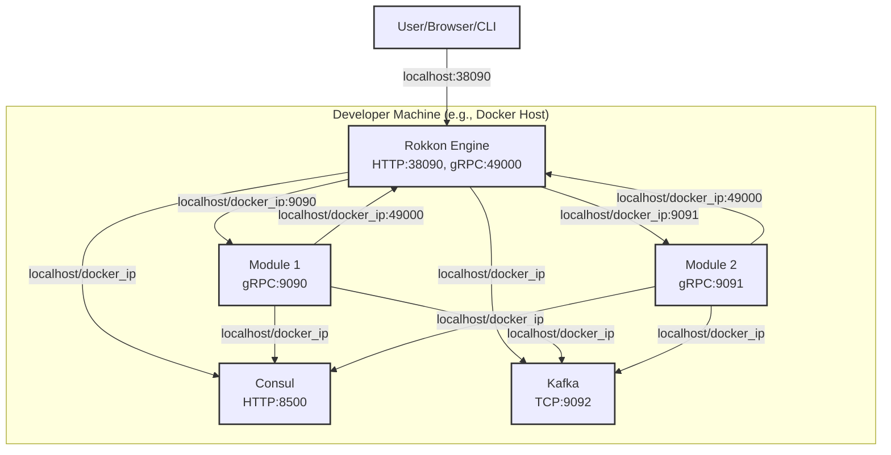
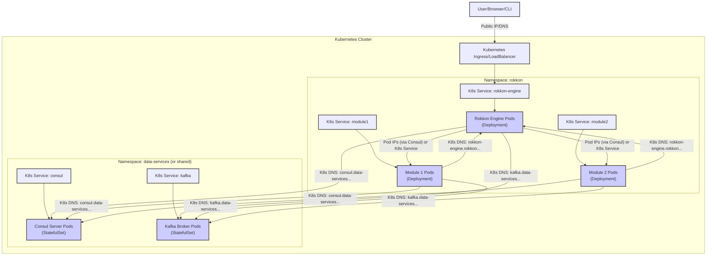

# Rokkon Engine: Network Topology

The Rokkon Engine and its ecosystem of modules, along with dependencies like Consul and Kafka, can be deployed in various network setups. The topology depends on factors like scale, security requirements, and whether the deployment is on-premises, cloud-based, or hybrid.

## Core Components and Communication

The key components and their primary communication patterns are:

1.  **Rokkon Engine:**
    *   Listens for gRPC requests (module registration, pipeline control, etc.) on its gRPC port (e.g., `49000`).
    *   Listens for HTTP/S requests (REST API for UI/CLI, WebSockets) on its HTTP port (e.g., `38090`).
    *   Connects to Consul (e.g., port `8500`) for service discovery (reading) and configuration (reading via `quarkus-consul-config`).
    *   Connects to the `engine-consul` writer service (if it's a separate entity, though often it's a component *within* the engine that exclusively writes to Consul) or directly writes to Consul (the documentation suggests `engine-consul` is the sole writer).
    *   Connects to Kafka brokers (e.g., port `9092`) as a producer/consumer for pipeline data.
    *   Connects to individual Pipeline Modules via gRPC (dynamic ports, discovered via Consul) to send data and control commands.

2.  **Pipeline Modules (Connectors, Steps, Sinks):**
    *   Listen for gRPC requests from the Rokkon Engine (or other modules if direct gRPC communication is used) on their own gRPC port (e.g., `9090`).
    *   Connect to the Rokkon Engine's `ModuleRegistrationService` (gRPC) for registration (often via `rokkon-cli`).
    *   Connect to Consul for health checking (Consul agent polls the module, or module pushes health status). Some modules might read their own config from Consul.
    *   Connect to Kafka brokers as producers/consumers.
    *   Connect to external data sources or sinks (databases, APIs, file systems, etc.) as per their function.

3.  **Consul:**
    *   Listens for HTTP API requests (e.g., port `8500`) from the Rokkon Engine, modules, and administrative tools.
    *   Consul servers communicate with each other in a cluster (serf LAN/WAN ports, RPC).
    *   Consul agents (if used on module hosts) communicate with Consul servers.

4.  **Kafka:**
    *   Listens for client connections (e.g., port `9092`) from the Rokkon Engine and modules.
    *   Kafka brokers communicate with each other and with ZooKeeper (if not using KRaft mode) in a cluster.

5.  **Frontend/CLI Users:**
    *   Connect to the Rokkon Engine's HTTP/S port for the web UI or REST API.

## Common Network Setups

### 1. Single-Host / Local Development Setup

*   **Description:** All components (Rokkon Engine, modules, Consul, Kafka) run on a single machine (e.g., a developer's laptop). Often uses Docker Compose.
*   **Networking:** Primarily uses `localhost` or Docker bridge network addresses.
*   **Use Case:** Development, testing, small demos.



### 2. Single Kubernetes Cluster Deployment

*   **Description:** All components are deployed as services/pods within a single Kubernetes cluster.
*   **Networking:**
    *   Kubernetes DNS is used for service-to-service communication (e.g., `rokkon-engine-service.namespace.svc.cluster.local`).
    *   Consul service discovery still plays a key role, especially for discovering individual module pod IPs and their health.
    *   External access to the Rokkon Engine UI/API is managed via Kubernetes Ingress or LoadBalancer services.
    *   Network Policies can be used to enforce stricter communication rules between pods.

```mermaid

graph TD
    subgraph "Kubernetes Cluster"
        subgraph "Namespace: rokkon"
            RokkonEngineService[K8s Service: rokkon-engine] --> RokkonEnginePods[Rokkon Engine Pods <br> (Deployment)]
            Module1Service[K8s Service: module1] --> Module1Pods[Module 1 Pods <br> (Deployment)]
            Module2Service[K8s Service: module2] --> Module2Pods[Module 2 Pods <br> (Deployment)]
        end
        subgraph "Namespace: data-services (or shared)"
            ConsulService[K8s Service: consul] --> ConsulPods[Consul Server Pods <br> (StatefulSet)]
            KafkaService[K8s Service: kafka] --> KafkaPods[Kafka Broker Pods <br> (StatefulSet)]
        end

        RokkonEnginePods -- K8s DNS: consul.data-services... --> ConsulPods
        RokkonEnginePods -- K8s DNS: kafka.data-services... --> KafkaPods

        %% Module registration to Engine
        Module1Pods -- K8s DNS: rokkon-engine.rokkon... --> RokkonEnginePods
        Module2Pods -- K8s DNS: rokkon-engine.rokkon... --> RokkonEnginePods

        %% Engine to Module communication (via Consul discovered Pod IPs or K8s Service for module type)
        RokkonEnginePods -- Pod IPs (via Consul) or K8s Service --> Module1Pods
        RokkonEnginePods -- Pod IPs (via Consul) or K8s Service --> Module2Pods

        %% Modules to Consul/Kafka
        Module1Pods -- K8s DNS: consul.data-services... --> ConsulPods
        Module1Pods -- K8s DNS: kafka.data-services... --> KafkaPods
        Module2Pods -- K8s DNS: consul.data-services... --> ConsulPods
        Module2Pods -- K8s DNS: kafka.data-services... --> KafkaPods

        %% External Access
        Ingress[Kubernetes Ingress/LoadBalancer] --> RokkonEngineService
    end

    User[User/Browser/CLI] -- Public IP/DNS --> Ingress

    classDef k8sService fill:#lightblue,stroke:#333,stroke-width:2px;
    classDef k8sPods fill:#ccf,stroke:#333,stroke-width:2px;
    classDef external fill:#lightgrey,stroke:#333,stroke-width:2px;

    class RokkonEngineService,Module1Service,Module2Service,ConsulService,KafkaService k8sService;
    class RokkonEnginePods,Module1Pods,Module2Pods,ConsulPods,KafkaPods k8sPods;
    class Ingress,User external;
```

### 3. Multi-Cluster / Hybrid Deployment (Advanced)

*   **Description:** Rokkon Engine might run in one cluster/VPC, while modules or data services (Kafka/Consul) run in different clusters, VPCs, or even on-premises.
*   **Networking:**
    *   Requires more complex networking solutions:
        *   **VPC Peering / VPN Tunnels:** To connect different private networks.
        *   **Consul WAN Federation:** To allow service discovery across different Consul datacenters/clusters.
        *   **Kafka Cross-Cluster Replication (e.g., MirrorMaker):** If data needs to be shared between Kafka clusters, or clients connect to a "local" Kafka cluster that mirrors a central one.
        *   **Public Endpoints with mTLS:** Services might expose themselves over the internet but secure communication with mutual TLS.
        *   **Service Mesh (e.g., Istio, Linkerd):** Can provide secure communication, traffic management, and observability across clusters.
*   **Use Case:** Large-scale deployments, geographical distribution, separation of concerns, migrating from on-premises to cloud.


**Key Considerations for Hybrid/Multi-Cluster:**
*   **Latency:** Network latency between components in different regions/datacenters can significantly impact performance, especially for synchronous gRPC calls. Asynchronous communication via Kafka becomes even more critical.
*   **Security:** All cross-site communication must be encrypted (e.g., TLS, VPN). Authentication and authorization become more complex.
*   **Service Discovery:** Consul WAN federation is essential for cross-site service discovery.
*   **Data Transfer Costs:** Egress/ingress costs between cloud regions or from on-premises to cloud can be substantial.

### 4. Air-Gapped / Highly Secure Environments

*   **Description:** All components are deployed within a network that has no external connectivity.
*   **Networking:**
    *   Strict internal network segmentation.
    *   All necessary dependencies (container images, libraries) must be available within the air-gapped network (e.g., via an internal container registry and artifact repository).
    *   Consul and Kafka run entirely within this environment.
    *   External data sources/sinks for connectors/sinks would need to be accessible via controlled internal proxies or data diodes if any interaction with the outside world is permitted at all.
*   **Challenges:** Updates, patches, and obtaining external libraries become more difficult. Monitoring and logging need to be self-contained.

## Network Security Considerations

Regardless of the topology:

1.  **Principle of Least Privilege:** Components should only be able to communicate with other components they absolutely need to. This can be enforced by:
    *   Firewall rules (Security Groups in Cloud, `iptables` on hosts).
    *   Kubernetes Network Policies.
    *   Consul intentions (if using Consul Connect service mesh).
2.  **Encryption in Transit:**
    *   **TLS for all HTTP traffic:** Rokkon Engine UI/API, Consul API.
    *   **TLS for all gRPC traffic:** Between engine and modules, module to module (if applicable). Quarkus makes gRPC TLS configuration straightforward.
    *   **TLS for Kafka communication:** Encrypt data between clients (engine, modules) and Kafka brokers, and between brokers themselves.
    *   **mTLS (Mutual TLS):** For stronger authentication where both client and server verify each other's certificates.
3.  **Encryption at Rest:** Sensitive configuration data in Consul or messages in Kafka (if stored on disk) should be encrypted.
4.  **Network Segmentation:** Isolate different parts of the application (e.g., management plane, data plane, specific tenants/clusters) into different subnets or VPCs with strict routing rules.
5.  **Regular Security Audits:** Review network configurations, firewall rules, and access logs.

Choosing the right network topology involves balancing performance, scalability, security, cost, and operational complexity. The Rokkon Engine's design, relying on established tools like gRPC, Consul, and Kafka, provides the flexibility to adapt to a wide range of these requirements.
