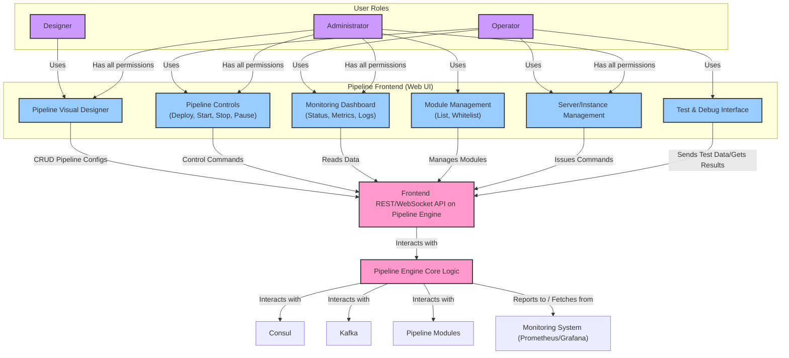

# Pipeline Engine: Operations and Management

Operating and managing the Pipeline Engine and its pipelines involves a combination of a user-facing frontend (Web UI), command-line interfaces (CLIs), and leveraging the underlying capabilities of its components like Quarkus and Consul. The goal is to provide visibility, control, and security over the data processing workflows.

## Frontend (Web UI) Features

A web-based frontend will serve as the primary interface for designers, operators, and administrators to interact with the Pipeline Engine.

1.  **Pipeline Design and Visualization:**
    *   **Visual Editor:** Allow users to drag and drop modules, connect them to define data flows, and configure individual pipeline steps.
    *   **Configuration Management:** Edit parameters for each step (module configurations, Kafka topics, gRPC targets, retry policies).
    *   **Import/Export:** Allow pipeline definitions to be imported/exported (e.g., as JSON or YAML).

2.  **Pipeline Deployment and Control:**
    *   **Deploy/Undeploy:** Trigger the deployment of new pipeline configurations or undeploy existing ones. This translates to the engine updating its internal state and potentially interacting with module deployment mechanisms if dynamic scaling is involved.
    *   **Start/Stop/Pause/Resume Pipelines:**
        *   **Start:** Activate a defined pipeline, causing the engine to begin orchestrating data flow through its steps.
        *   **Stop:** Gracefully shut down a pipeline, ensuring in-flight data is processed or moved to a Dead Letter Queue (DLQ), and consumers/producers are stopped.
        *   **Pause/Resume:** Temporarily halt data consumption from sources like Kafka or gRPC inputs for a pipeline or specific steps, and then resume it. (See `Kafka_integration.md` for Kafka-specifics).
    *   **Live Updates:** Ability to modify certain pipeline parameters (e.g., a specific step's configuration, routing rules) for an already running pipeline, with the engine dynamically applying these changes.

3.  **Monitoring and Status Dashboard:**
    *   **Pipeline Status:** View the current state of all pipelines (e.g., running, paused, stopped, degraded).
    *   **Step-Level Metrics:** Display metrics for individual pipeline steps (e.g., messages processed, error rates, processing times). This data would be sourced from Prometheus/Grafana (see `Monitoring_operations.md`).
    *   **Module Health:** Show the status of registered module instances (discovered via Consul).
    *   **Log Viewer:** Provide access to aggregated logs from the engine and potentially from modules.

4.  **Module Management:**
    *   **List Registered Modules:** Display all modules currently registered with the engine, along with their type, version, and instance count.
    *   **Whitelist Management (Admin):** Manage the list of allowed module types that can be used in pipelines.

5.  **Server Management (Manual Intervention):**
    *   **View Engine Instances:** If the engine itself is clustered, show the status of each engine instance.
    *   **Remove Servers from Mix (Manual Override):** For module instances, if Consul's health checking is too slow or a problematic instance needs to be immediately isolated, an operator might need a way to manually instruct the engine to temporarily stop sending traffic to a specific module instance. This is an emergency override.
        *   This could involve the engine temporarily blacklisting an instance ID or interacting with a load balancer if one is explicitly managed.

6.  **Testing and Debugging:**
    *   **`test-module` Integration:** Provide an interface to interact with the `test-module` (or a similar debugging tool). This would allow users to:
        *   Send sample `PipeDoc` data to a specific module or a segment of a pipeline.
        *   View the output and any errors.
        *   Simulate different conditions (e.g., module failures, slow responses).
    *   **Data Sampling/Peeking:** Ability to view sample messages from Kafka topics within a pipeline or outputs from gRPC steps (respecting data privacy and security).



## Security Features in Quarkus (Role-Based Access Control)

As mentioned in `Initialization.md`, Quarkus provides robust security features. The frontend will leverage these for authentication and authorization.

*   **Authentication:** Users will log in, and their identity will be established (e.g., via OIDC with Okta, Keycloak, or another identity provider).
*   **Authorization (Roles):**
    *   **`designer`:**
        *   Can create, view, and modify pipeline designs.
        *   Can run tests on pipelines they have access to.
        *   Cannot deploy pipelines to production or manage system-level settings.
    *   **`operator`:**
        *   Can deploy, start, stop, pause, and resume pipelines (typically in specific environments like staging or production).
        *   Can monitor pipeline status and metrics.
        *   Can perform basic troubleshooting, like viewing logs or manually removing a misbehaving server instance (module instance).
        *   May have limited design modification rights (e.g., only certain parameters).
    *   **`admin`:**
        *   Full control over the system.
        *   Can manage user roles and permissions (if not handled by an external IdP).
        *   Can manage module whitelists and global engine configurations.
        *   Can perform all actions of `designer` and `operator` across all environments/clusters.
*   **Implementation:**
    *   Quarkus security annotations (`@RolesAllowed`, `@Authenticated`) will protect the JAX-RS (REST) endpoints that the frontend communicates with.
    *   Example:
        ```java
        // In Pipeline Engine's REST API layer
        @Path("/api/v1/pipelines/{pipelineId}/deploy")
        public class PipelineDeploymentResource {
            @POST
            @RolesAllowed({"operator", "admin"}) // Only operators or admins can deploy
            public Response deployPipeline(@PathParam("pipelineId") String pipelineId) {
                // ... logic to deploy the pipeline
                return Response.ok().build();
            }
        }

        @Path("/api/v1/pipelines/design")
        public class PipelineDesignResource {
            @POST
            @RolesAllowed({"designer", "admin"}) // Designers or admins can create designs
            public Response savePipelineDesign(String designData) {
                // ... logic to save pipeline design
                return Response.ok().build();
            }
        }
        ```
*   **ACL-Based Systems:** For more granular control, especially if permissions need to be tied to specific pipeline instances or clusters, the Quarkus security mechanisms can be extended:
    *   Implement custom `io.quarkus.security.permission.PermissionChecker` instances.
    *   These checkers can query an external ACL system or evaluate policies based on the user's identity and the resource being accessed.
    *   For example, an operator might only be allowed to manage pipelines belonging to their specific business unit's cluster.

## CLI for Operations

While the frontend provides a user-friendly interface, a Command Line Interface (CLI) is essential for automation, scripting, and advanced users.

*   **`pipeline-cli` (Extended):** The existing `pipeline-cli.jar` used for module registration could be extended or complemented by another CLI tool focused on operational tasks.
*   **Capabilities:**
    *   Listing pipelines and their statuses.
    *   Deploying/starting/stopping/pausing pipelines from a configuration file.
    *   Querying module status.
    *   Exporting/importing pipeline definitions.
    *   Streaming logs.
    *   Interacting with the `test-module`.
    *   Performing administrative tasks (e.g., managing users or whitelists, if applicable).
*   **Authentication:** The CLI would also need to authenticate with the Pipeline Engine's API, likely using API keys or OAuth2 client credentials flow.

## Further Reading

*   **Initialization (`Initialization.md`):** Discusses Quarkus security features and roles.
*   **Monitoring/Operations (`Monitoring_operations.md`):** Details how monitoring data is collected and visualized, which feeds into the frontend dashboard.
*   **Kafka Integration (`Kafka_integration.md`):** Explains pause/resume capabilities for Kafka-based steps.
*   **Quarkus Security Guides:** For implementing authentication and authorization.
*   **Consul Documentation:** For understanding service health and how it's reflected.

By providing a comprehensive frontend and powerful CLI tools, backed by robust security and clear role definitions, the Pipeline Engine can be effectively operated and managed throughout its lifecycle.
