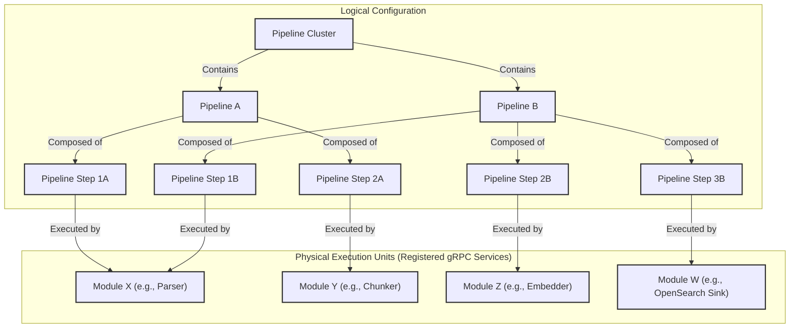
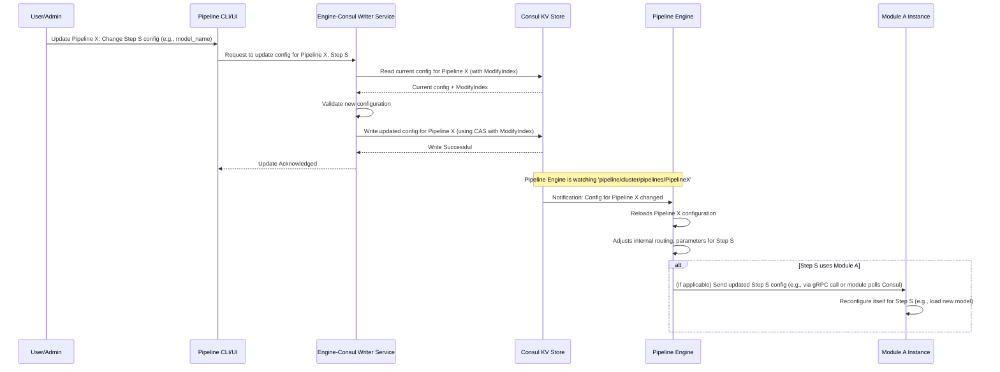

# Pipeline Engine: Pipeline Design

## Logical Design Hierarchy

The Pipeline Engine organizes data processing workflows using a hierarchical structure. This design allows for clear separation of concerns, modularity, and scalability. The main components of this hierarchy are: Clusters, Pipelines, Pipeline Steps, and Modules.



1.  **Pipeline Clusters (`PipelineClusterConfig`):**
    *   A cluster is the highest-level organizational unit. It represents a logical grouping of pipelines, often associated with a specific tenant, project, or environment (e.g., "production-text-processing", "development-image-analysis").
    *   Each cluster can have its own default configurations, such as default Kafka topics or error handling strategies, that pipelines within it can inherit or override.
    *   Clusters provide a namespace for pipelines, helping to manage and isolate different sets of workflows.
    *   Configuration for clusters is typically stored in Consul (e.g., `pipeline/<cluster_name>/cluster-config`).

2.  **Pipelines (`PipelineConfig`):**
    *   A pipeline defines a specific end-to-end data processing workflow. It consists of an ordered sequence of pipeline steps.
    *   Each pipeline has a unique identifier within its cluster.
    *   It specifies the initial step(s) that trigger the workflow and how data flows between steps.
    *   Pipelines can be linear or branched (fan-out/fan-in).
    *   Key attributes of a pipeline configuration include:
        *   `pipeline_id`: Unique identifier.
        *   `description`: Human-readable description.
        *   `initial_steps`: A list of starting step IDs.
        *   `steps`: A collection of all pipeline step configurations within this pipeline.
    *   Pipeline configurations are stored in Consul (e.g., `pipeline/<cluster_name>/pipelines/<pipeline_id>`).

3.  **Pipeline Steps (`PipelineStepConfig`):**
    *   A pipeline step represents a single stage of processing within a pipeline.
    *   Each step is configured to use a specific *type* of registered module (e.g., "parser-v1", "sentence-embedder-mpnet").
    *   Key attributes of a pipeline step configuration include:
        *   **`stepName`**: Unique identifier for the step within the pipeline.
        *   **`stepType`**: The type of step (e.g., `INITIAL_PIPELINE`, `PIPELINE`, `SINK`).
        *   **`processorInfo`**: Specifies the executor for this step. This can be either an external gRPC module (`grpcServiceName`) or an internal CDI bean (`internalProcessorBeanName`).
        *   **`kafkaInputs`**: A list of Kafka topics this step consumes from. This is how a step can be triggered asynchronously.
        *   **`outputs`**: A map defining where the output of this step should be routed. Each output specifies a `targetStepName` and a `transportType` (gRPC or Kafka), enabling fan-out.
        *   **`customConfig`**: Step-specific configuration parameters passed to the module.
        *   **Retry and Timeout Policies**: Fields like `maxRetries` and `stepTimeoutMs` for controlling resilience.
    *   Multiple steps in the same or different pipelines can use the same module type but with different configurations.

4.  **Modules (Registered gRPC Services):**
    *   Modules are the actual executable components (gRPC services) that perform the data processing tasks. They are the "workers" in the system.
    *   Examples: `gutenberg-connector`, `html-parser`, `text-chunker`, `bert-embedder`, `opensearch-sink`.
    *   Modules are developed independently and can be written in any gRPC-supported language.
    *   They register with Consul, advertising their type (e.g., "parser", "embedder"), version, and capabilities.
    *   The Pipeline Engine discovers available modules via Consul and matches them to pipeline steps based on the `module_type` specified in the step configuration.
    *   A single registered module (e.g., `parser-module-v1.2`) can serve multiple pipeline steps across various pipelines, potentially with different configurations for each step.

## Dynamic Configuration System

A cornerstone of the Pipeline Engine's flexibility is its dynamic configuration system, primarily managed through Consul's Key-Value (KV) store.

*   **Centralized Storage:** All configurations for clusters, pipelines, and steps are stored in Consul. This provides a single source of truth.
    *   Example Path in Consul: `pipeline/default_cluster/pipelines/my_document_pipeline`
    *   The value at this path would be a JSON (or properties) representation of the `PipelineConfig`.
*   **Hot Reloading/Dynamic Updates:** The Pipeline Engine (and potentially individual modules) can watch for changes to these configurations in Consul.
    *   When a pipeline configuration is updated in Consul, the engine can detect this change and dynamically adjust the pipeline's behavior without requiring a restart. This could involve:
        *   Adding or removing steps.
        *   Changing the module used for a step.
        *   Modifying a step's configuration (e.g., updating an API key, changing a model name).
        *   Altering routing logic (e.g., adding a new output topic for a step).
    *   This is typically achieved using Consul's watch mechanism or by periodically polling for changes. Quarkus has built-in support for Consul configuration, which can facilitate this.
*   **Versioning (Implicit via Consul):** Consul KV entries have a `ModifyIndex`. This can be used to track versions of configurations and for optimistic locking (Compare-And-Swap operations) when updating configurations to prevent race conditions.
*   **Decoupling:** The dynamic configuration system decouples the pipeline logic (defined in Consul) from the engine's core code and the module implementations. This allows for rapid iteration on pipeline designs.



## Making Connectors, Sinks, and Pipeline Steps

Modules (connectors, sinks, pipeline steps) are fundamentally gRPC services that adhere to specific interfaces defined by Pipeline's Protocol Buffers (protobufs). This allows them to be integrated into the Pipeline Engine.

### Core Protobuf Definitions (`commons/protobuf`)

The `commons/protobuf` project defines the contracts for module communication. Key services and messages include:

*   **`PipeStream`**: The main message that flows through the system. It acts as an envelope containing the document being processed and metadata about the pipeline execution itself, such as the `stream_id` and history.
*   **`PipeDoc`**: The actual document being processed. It contains the content (e.g., text, binary data) and semantic information like chunks and embeddings. A `PipeStream` always contains a `PipeDoc`.
*   **`PipeStepProcessor.proto`:** Defines the primary service that processing modules (steps, connectors, sinks) must implement.
    ```protobuf
    // Located in commons/protobuf/src/main/proto/services/pipe_step_processor.proto
    service PipeStepProcessor {
      // Processes a single PipeDoc or a stream of PipeDocs
      // Can be unary or client/server streaming depending on the module's nature
      rpc ProcessData(ProcessRequest) returns (ProcessResponse); // Example: simple request/response
      // rpc ProcessStream(stream ProcessRequest) returns (stream ProcessResponse); // Example: bidirectional streaming

      // Called by the engine to get module's registration details
      rpc GetServiceRegistration(google.protobuf.Empty) returns (ServiceRegistrationData);

      // Called by the engine during registration to perform a health/capability check
      rpc RegistrationCheck(RegistrationCheckRequest) returns (RegistrationCheckResponse);
    }

    message PipeDoc { // Simplified
      string document_id = 1;
      bytes data = 2; // The actual content being processed
      map<string, string> metadata = 3;
      // ... other common fields like source, timestamps, error info
    }

    message ProcessRequest {
      PipeDoc pipe_doc = 1;
      map<string, string> step_config = 2; // Configuration for this specific step execution
    }

    message ProcessResponse {
      PipeDoc processed_pipe_doc = 1;
      bool success = 2;
      string error_message = 3;
    }

    message ServiceRegistrationData {
      string module_type = 1; // e.g., "parser", "embedder-v2"
      string module_id = 2;   // Unique ID for this instance
      string version = 3;
      // ... other capabilities like supported input/output formats
    }
    ```

*   **`common/document.proto`, `common/pipeline.proto`:** Define common data structures like `PipeDoc`, `PipelineConfig`, etc.

### Implementing a Module (Example in Python for a simple Chunker)

```python
# chunker_module.py
import grpc
from concurrent import futures
import time

# Assume these are generated from commons/protobuf
import pipe_step_processor_pb2 as ps_pb2
import pipe_step_processor_pb2_grpc as ps_grpc_pb2
from google.protobuf import empty_pb2

class ChunkerService(ps_grpc_pb2.PipeStepProcessorServicer):
    def GetServiceRegistration(self, request, context):
        return ps_pb2.ServiceRegistrationData(
            module_type="python-chunker",
            module_id="chunker-instance-01", # Usually dynamically generated or configured
            version="0.1.0"
        )

    def RegistrationCheck(self, request, context):
        # Perform any self-checks, e.g., model loading, dependency checks
        print(f"Registration check called with config: {request.config_params}")
        return ps_pb2.RegistrationCheckResponse(healthy=True, message="Chunker is ready")

    def ProcessData(self, request, context):
        print(f"Chunker received document: {request.pipe_doc.document_id}")
        step_config = dict(request.step_config)
        chunk_size = int(step_config.get("chunk_size", "1000")) # Get config from request

        text_content = request.pipe_doc.data.decode('utf-8')
        chunks = [text_content[i:i + chunk_size] for i in range(0, len(text_content), chunk_size)]

        # For simplicity, this example returns only the first chunk.
        # A real module would typically use streaming or Kafka to output multiple chunks.
        if chunks:
            processed_doc = ps_pb2.PipeDoc(
                document_id=f"{request.pipe_doc.document_id}_chunk_0",
                data=chunks[0].encode('utf-8'),
                metadata=request.pipe_doc.metadata
            )
            return ps_pb2.ProcessResponse(processed_pipe_doc=processed_doc, success=True)
        else:
            return ps_pb2.ProcessResponse(success=False, error_message="No content to chunk")

def serve():
    server = grpc.server(futures.ThreadPoolExecutor(max_workers=10))
    ps_grpc_pb2.add_PipeStepProcessorServicer_to_server(ChunkerService(), server)

    module_port = "[::]:9090" # Configurable
    server.add_insecure_port(module_port)
    print(f"Chunker module listening on port {module_port}")
    server.start()

    # Registration with Pipeline Engine (via CLI tool or library) would happen here
    # Example: os.system(f"rokkon-cli register --module-type python-chunker --port 9090 ...")

    try:
        while True:
            time.sleep(86400) # Keep alive
    except KeyboardInterrupt:
        server.stop(0)

if __name__ == '__main__':
    serve()
```

### Implementing a Module (Example in Java/Quarkus for an Embedder)

```java
// EmbedderModule.java (Quarkus gRPC Service)
package com.rokkon.modules.embedder;

import com.rokkon.proto.common.Common.*; // Assuming PipeDoc is here
import com.rokkon.proto.services.PipeStepProcessor.*; // For service messages
import com.rokkon.proto.services.PipeStepProcessorServiceGrpc.*; // For service base class

import io.quarkus.grpc.GrpcService;
import io.smallrye.mutiny.Uni;
import com.google.protobuf.Empty;

// Placeholder for an actual embedding library
class EmbeddingClient {
    public float[] embed(String text, String modelName) { return new float[]{0.1f, 0.2f}; }
}

@GrpcService
public class EmbedderModule extends PipeStepProcessorImplBase {

    private EmbeddingClient embeddingClient = new EmbeddingClient();

    @Override
    public Uni<ServiceRegistrationData> getServiceRegistration(Empty request) {
        return Uni.createFrom().item(ServiceRegistrationData.newBuilder()
                .setModuleType("quarkus-embedder")
                .setModuleId("embedder-instance-02") // Dynamic or configured
                .setVersion("1.0.0")
                .build());
    }

    @Override
    public Uni<RegistrationCheckResponse> registrationCheck(RegistrationCheckRequest request) {
        // Check if embedding models can be loaded based on request.getConfigParams()
        System.out.println("Registration check for embedder with config: " + request.getConfigParamsMap());
        return Uni.createFrom().item(RegistrationCheckResponse.newBuilder()
                .setHealthy(true).setMessage("Embedder ready, models accessible.")
                .build());
    }

    @Override
    public Uni<ProcessResponse> processData(ProcessRequest request) {
        PipeDoc inputDoc = request.getPipeDoc();
        String textToEmbed = inputDoc.getData().toStringUtf8();
        String modelName = request.getStepConfigMap().getOrDefault("embedding_model", "default-model");

        // Perform embedding
        float[] vector = embeddingClient.embed(textToEmbed, modelName);

        // For simplicity, storing vector as a comma-separated string in metadata.
        // A real implementation would use a proper field in PipeDoc (e.g., repeated float).
        PipeDoc outputDoc = inputDoc.toBuilder()
                .putMetadata("embedding_vector_model_a", java.util.Arrays.toString(vector))
                .build();

        return Uni.createFrom().item(ProcessResponse.newBuilder()
                .setProcessedPipeDoc(outputDoc)
                .setSuccess(true)
                .build());
    }
}
```

**Power of Protobufs:**

1.  **Language Agnostic Contracts:** As seen, Python and Java modules implement the same `service PipeStepProcessor` contract. This allows the Pipeline Engine (likely Java-based) to communicate with them seamlessly.
2.  **Code Generation:** Protobuf compilers generate client and server stub code in various languages, significantly reducing boilerplate for developers.
3.  **Strong Typing & Schema Evolution:** Data structures are well-defined, reducing integration errors. Protobufs have rules for evolving schemas (adding fields, deprecating old ones) in a backward-compatible way.
4.  **Efficiency:** Protobufs serialize to a compact binary format, making data transmission efficient.
5.  **Rich Data Structures:** Support for complex data types, including nested messages, lists (repeated fields), and maps.

By defining these clear gRPC interfaces, Pipeline allows developers to focus on the core logic of their connectors, processing steps, or sinks, using the tools and languages they are most comfortable with, while ensuring interoperability within the broader pipeline ecosystem. The dynamic configuration system then wires these modules together into meaningful workflows.
